# **Abstract**

> In this technical blog, we investigate state of the art object detection algorithms and their implementations in MMDetection. We write an up-to-date guide for setting up MMDetection and structured Pascal-VOC and COCO-2017 data in Google Colab based on our experience. The key components(detection head/neck/backbone) and structure of MMdetection models are analysed and classified. After which, we reproduce the object detection task for popular models on main-stream benchmarks including COCO-2017 dataset and construct a datailed interactive table. In the last part of our blog, we use signature object detection algorithms on real-live photos and videos taken at UCLA campus and provide error analysis. We then perform adversarial attacks on our models using representave photos and evaluate their effects.


# **Table of Contents**


{: class="table-of-content"}
* TOC
{:toc}


1. Object Detection Basics
2. MMdetection Setup and Data Preparation
3. Model Structure and Classification
4. Interactive Model/Backbone Results Table
5. Photo/Video Demo and Error Analysis
6. Adversiarial Attacks and Error Analysis


# **1. Object Detection Basics**


## Object Localization:
In object localization, we use a special type of label to express class and bounding box position, as follows:
Each input image X with a label y = [y1, y2, y3, y4, y5, y6, y7, y8],where y1 = Pc = 1 if there is an object else 0, y2 = nx, x coordinate of the center of the bounding box, y3 = ny, y coordinate of the center of the bounding box, y4 = nw, width of bounding box, y5 = nh, height of bounding box, y6 = 1 if the object is class 1 else 0, y7 = 1 if the object is class 2 else 0, y8 = 1 if the object is class 3 else 0.

## Landmark detection
Landmark detection is delineating a shape using many points on that shape, its data format is as follows: instead of nx, ny, nw, nh, we use a series of points: p1x, p1y, p2x, p2y,....p64x, p64y to represent a series of dots on a shape, say eye or jawline.

## Object Detection

input x = closely cropped image of a car at the center of the image, output y = 1 if this is a car else 0

sliding windows detection: focus on each window of the image and decide whether there is a car, and slide the window by one stride. The disadvantage is huge computational cost.

The solution is to use Convolutional Implementation of Sliding Window Detection, which turns FC layer into convolutional layer.

## Bounding Box Predictions

YOLO algorithm is a one-stage algorithm that only looks once, instead of looking at the image twice as in Faster-RCNN.

Intersection over Union (IoU) is a useful way to calculate overlapping.

Non-max suppression: detect the object only once, pick the bounding box with the largest IoU

Anchor-boxes are predefined shapes of bounding boxes.

## Region Proposal

R-CNN (Regions CNN) is a segmentation algorithm.

R-CNN proposes regions, and then the headerclassifies proposed regions one at a time. Output is label + bounding box.

The downside of this approach is that it runs quite slow.

- need to classify one region at a time 

Fast R-CNN improves by using convolutional implementation of sliding windows to classify all proposed regions.

- classify all regions all at once with convolutional implementation of sliding windows.
- but the Propose Region part is still slow

Faster R-CNN: further improves based on Fast R-CNN by using convolutional network to propose regions.

Andrew Ng claims Faster R-CNN still slower than YOLO algorithm.


# **2. MMdetection Setup and Data Preparation**

## Environment Setup
Setup and version control is usually the most time-consuming step if not done well. So here we write an up-to-date colab setup guide and our experience dealing with problems in the MMDetection offcial setup docs.

1. In your google drive, create a new .ipynb file for environment setup, here I name it “SETUP.ipynb”. In SETUP.ipynb do the following environment setup
2. First mount your google drive
    
    ```python
    import os
    from google.colab import drive
    drive.mount('/content/drive')
    ```
    
3. Here I create a new directory named “MMDet1” and cd into it
    
    ```python
    ! mkdir MMDet1
    %cd /content/drive/My Drive/MMDet1
    ```
    
4. Now we can use pip to install the mmdetection package and other dependencies
    
    I made some adjustments to the official colab tutorial at:
    
     [https://github.com/open-mmlab/mmdetection/blob/master/demo/MMDet_Tutorial.ipynb](https://github.com/open-mmlab/mmdetection/blob/master/demo/MMDet_Tutorial.ipynb)
    
    ```python
    # install dependencies: (use cu101 because colab has CUDA 10.1)
    !pip install -U torch==1.5.1+cu101 torchvision==0.6.1+cu101 -f https://download.pytorch.org/whl/torch_stable.html
    
    # install mmcv-full thus we could use CUDA operators
    !pip install mmcv-full
    
    # Install mmdetection
    !rm -rf mmdetection
    !git clone https://github.com/open-mmlab/mmdetection.git
    %cd mmdetection
    
    !pip install -e .
    
    # install Pillow 7.0.0 back in order to avoid bug in colab
    !pip install Pillow==7.0.
    ```
    
     The above installation command does not specify version of MMCV, this could lead to confusing error messages later on. it would also result in an unusually long download time. So here I change the original implementation to specify version details:
    
    ```python
    # install dependencies: (use cu101 because colab has CUDA 10.1)
    !pip install -U torch==1.8.1+cu111 torchvision==0.9.1+cu111 -f https://download.pytorch.org/whl/torch_stable.html
    
    # install mmcv-full thus we could use CUDA operators
    # !pip install mmcv-full 
    
    !pip install mmcv-full -f https://download.openmmlab.com/mmcv/dist/cu111/torch1.8.0/index.html
    
    # Install mmdetection
    !rm -rf mmdetection
    !git clone https://github.com/open-mmlab/mmdetection.git
    %cd mmdetection
    
    !pip install -e .
    
    # install Pillow 7.0.0 back in order to avoid bug in colab
    !pip install Pillow==7.0.0
    ```
    
    Executing the above block takes about 5 minutes for me.
    
5. Next we import the installed packages. (remember to set your runtime to GPU) Print package version to verify that we installed correctly:
    
    ```python
    # Check Pytorch installation
    import torch, torchvision
    print(torch.__version__, torch.cuda.is_available())
    
    # Check MMDetection installation
    import mmdet
    print(mmdet.__version__)
    
    # Check mmcv installation
    from mmcv.ops import get_compiling_cuda_version, get_compiler_version
    print(get_compiling_cuda_version())
    print(get_compiler_version())
    ```
    
    if everything is correct, this block should output:
    
    ```python
    1.8.1+cu111 True
    2.21.0
    11.1
    GCC 7.3
    ```
    

## Dataset Preparation
Next we prepare the Pascal_VOC and COCO-2017 datasets in our mmdetection folder, we need to setup the datasets in given structure so that mmdetection knows how to read them.

I wrote a colab tutorial on this part at:
[Google Colaboratory](https://colab.research.google.com/drive/1-wVLMduYdDXlFtgUIhhWxpTCWwOexXa8#scrollTo=bKZ_LzeLGkfe)

1. First setup drive environment by installing mmdetection and going into the folder we created last time:
    
    ```python
    %load_ext autoreload
    %autoreload 2
    ```
    
    ```python
    import os
    from google.colab import drive
    drive.mount('/content/drive', force_remount=True)
    ```
    
    ```python
    # install dependencies: (use cu101 because colab has CUDA 10.1)
    #!pip install -U torch==1.5.1+cu101 torchvision==0.6.1+cu101 -f https://download.pytorch.org/whl/torch_stable.html
    !pip install -U torch==1.8.1+cu111 torchvision==0.9.1+cu111 -f https://download.pytorch.org/whl/torch_stable.html
    
    # install mmcv-full thus we could use CUDA operators
    # !pip install mmcv-full 
    
    # !!!!!!!!!!remember to install with specific version number!!!!!!!!!!!
    !pip install mmcv-full -f https://download.openmmlab.com/mmcv/dist/cu111/torch1.8.0/index.html
    
    # Install mmdetection
    !rm -rf mmdetection
    !git clone https://github.com/open-mmlab/mmdetection.git
    %cd mmdetection
    
    !pip install -e .
    
    # install Pillow 7.0.0 back in order to avoid bug in colab
    !pip install Pillow==7.0.0
    ```
    
2. Dataset download: COCO-2017

    
    ```python
    # here we download the dataset inside our mmdetection folder
    
    !python3 tools/misc/download_dataset.py --dataset-name coco2017 
    
    # remember that the command only downloads the zip files containing the coco dataset
    # to actually use the dataset, we need to unzip first
    ```
    
3. Unzip the coco dataset. This may take approximately 2 hours, do not close browser during any part of this process!!!!

    
    ```python
    !unzip "data/coco/annotations_trainval2017.zip" -d "data/coco/"
    
    !unzip "data/coco/test2017.zip" -d "data/coco/"
    
    !unzip "data/coco/train2017.zip" -d "data/coco/"
    
    !unzip "data/coco/val2017.zip" -d "data/coco/"
    ```
    
4. Dataset download: Pascal_VOC 2007

    
    ```python
    # here we download the dataset inside our mmdetection folder
    
    !python3 tools/misc/download_dataset.py --dataset-name voc2007
    
    # remember that the command only downloads the zip files containing the coco dataset
    # to actually use the dataset, we need to unzip first
    ```
    
5. Unzip the PASCAL-VOC dataset. This is quicker than the coco dataset due to smaller size and tar over zip, again, remebmder not to close browser during any part of this process!!!!

    
    ```python
    # voc is faster to load because of its smaller size and the fact that it uses tar instead of zip
    
    !tar -xvf "data/voc/VOCdevkit_08-Jun-2007.tar" -C "data/voc/"
    
    !tar -xvf "data/voc/VOCtest_06-Nov-2007.tar" -C "data/voc/"
    
    !tar -xvf "data/voc/VOCtrainval_06-Nov-2007.tar" -C "data/voc/"
    ```
    
6. Now just wait a few hours for google drive to load all the images and you are good to go! You can also run the detection now using the images stored in Cache(wierd drive memory).


# **3. Model Structure and Classification**

## **Model Structure**

There is a popular paradigm for deep learning-based object detectors: the backbone network (typically designed for classification and pre-trained on ImageNet) extracts basic features from the input image, and then the neck (e.g., feature pyramid network) enhances the multi-scale features from the backbone, after which the detection head predicts the object bounding boxes with position and classification information. Based on detection heads, the cutting edge methods for generic object detection can be briefly categorized into two major branches. The first branch contains one-stage detectors such as YOLO, SSD, RetinaNet, NAS-FPN, and EfficientDet. The other branch contains two-stage methods such as Faster R-CNN, FPN, Mask RCNN, Cascade R-CNN, and Libra R-CNN. Recently, academic attention has been geared toward anchor-free detectors due partly to the emergence of FPN and focal Loss, where more elegant end-to-end detectors have been proposed. On the one hand, FSAF, FCOS, ATSS and GFL improve RetinaNet with center-based anchor-free methods. On the other hand, CornerNet and CenterNet detect object bounding boxes with a keypoint-based method.

reference: https://arxiv.org/pdf/2107.00420.pdf


## **Model Components in MMdetection**

Based on the information above, we can better understand how MMDetection constructs its models. In MMDetection, models are constructed using the following three components as the main building blocks:

- Backbone: First MMdetection uses a FCN backbone network to extract feature maps from images. This part has the largest influence on prediction results.
- Neck: Then the neck enhances the multi-scale features from the backbone. This is the part between backbones and heads, usually models just use FPN as default method.
- Detection Head: After the input image processed by the backbone and neck parts, MMdetection passes the results to detection heads to perform specific tasks such as bounding box prediction and mask prediction.

In addition, the following two components are customizable within each model:

- ROI Extractor: this part extracts features from feature maps
- Loss: the component in head for calculating losses


## **Examples for Each Component**

Main Components:

- Backbone: ResNet, VGG, ResNeXt, SWIN, PVT
- Neck: FPN, CARAFE, ASPP
- Detection Head: bbox prediction,  mask prediction

Sub-Components:

- ROI Extractor: RoI Pooling, RoI Align
- Loss: L1Loss, L2Loss, GHMLoss, FocalLoss


## **Model Classification:**

### **Frameworks:**

We categorize MMdetection frameworks into two categories based on their detection heads, there are: 1-stage detection model and 2-stage detection models.

Popular frameworks that we hope to investigate are listed below:

- 1-stage detection models:
    - YOLO-X
    - YOLOv2
    - YOLOv3
    - SSD
    - DSSD
    - RetinaNet
    - NAS-FPN
    - EfficientDet

- 2-stage detection models:
    - R-CNN
    - Fast-R-CNN
    - Faster-R-CNN
    - FPN
    - Mask-R-CNN
    - Cascade-R-CNN
    - Libra R-CNN
    - SPP-Net

### **Backbones:**

MMdetection Backbones can also be categorized into two categories based on whether they predominately use Convolutional Neurel Networks or the Encoder-Decoder Transformer structure to perform feature extraction.

Popular frameworks that we hope to investigate are listed below:

- CNN-Based Backbones:
    - VGG (ICLR'2015)
    - ResNet (CVPR'2016)
    - ResNeXt (CVPR'2017)
    - MobileNetV2 (CVPR'2018)
    - [HRNet (CVPR'2019)](https://github.com/open-mmlab/mmdetection/blob/master/configs/hrnet)
    - [Generalized Attention (ICCV'2019)](https://github.com/open-mmlab/mmdetection/blob/master/configs/empirical_attention)
    - [GCNet (ICCVW'2019)](https://github.com/open-mmlab/mmdetection/blob/master/configs/gcnet)
    - [Res2Net (TPAMI'2020)](https://github.com/open-mmlab/mmdetection/blob/master/configs/res2net)
    - [RegNet (CVPR'2020)](https://github.com/open-mmlab/mmdetection/blob/master/configs/regnet)
    - [ResNeSt (ArXiv'2020)](https://github.com/open-mmlab/mmdetection/blob/master/configs/resnest)

- Transformer-Based Backbones:
    - [Swin (CVPR'2021)](https://github.com/open-mmlab/mmdetection/blob/master/configs/swin)
    - [PVT (ICCV'2021)](https://github.com/open-mmlab/mmdetection/blob/master/configs/pvt)
    - [PVTv2 (ArXiv'2021)](https://github.com/open-mmlab/mmdetection/blob/master/configs/pvt)

### **Necks:**

At last, here is a list of Necks commonly used in MMDetection. Due to its limited influence over detection results, we do not focus on the effects of different necks on detection results. We only use PAFPN in our investigations of Model Backbone and Detection Framework. 

Popular necks in MMDetection are listed below:

- [PAFPN (CVPR'2018)](https://github.com/open-mmlab/mmdetection/blob/master/configs/pafpn)
- [NAS-FPN (CVPR'2019)](https://github.com/open-mmlab/mmdetection/blob/master/configs/nas_fpn)
- [CARAFE (ICCV'2019)](https://github.com/open-mmlab/mmdetection/blob/master/configs/carafe)
- [FPG (ArXiv'2020)](https://github.com/open-mmlab/mmdetection/blob/master/configs/fpg)
- [GRoIE (ICPR'2020)](https://github.com/open-mmlab/mmdetection/blob/master/configs/groie)


## **Config Name Style**

When using or contributing to the MMDetection library, the most important file that the user will call/customize is the model config file. It is very important that we have a good understanding of the config file naming convention before we perform actual tasks with MMDetection, so that we can configurate the model to be just what we have in mind. First, lets take a look at the universal config file name:


```python
**{model}_[model** **setting]_{backbone}_{neck}_[norm** **setting]_[misc]_[gpu** **x** **batch_per_gpu]_{schedule}_{dataset}**
```


Now, given that we understood the Model Structure in MMDetection writen above, we can better understand the various config naming components listed below:


**`{xxx}` is required field and `[yyy]` is optional.**

- **`{model}`: model type like `faster_rcnn`, `mask_rcnn`, etc.**
- **`[model setting]`: specific setting for some model, like `without_semantic` for `htc`, `moment` for `reppoints`, etc.**
- **`{backbone}`: backbone type like `r50` (ResNet-50), `x101` (ResNeXt-101).**
- **`{neck}`: neck type like `fpn`, `pafpn`, `nasfpn`, `c4`.**
- **`[norm_setting]`: `bn` (Batch Normalization) is used unless specified, other norm layer type could be `gn` (Group Normalization), `syncbn` (Synchronized Batch Normalization). `gn-head`/`gn-neck` indicates GN is applied in head/neck only, while `gn-all` means GN is applied in the entire model, e.g. backbone, neck, head.**
- **`[misc]`: miscellaneous setting/plugins of model, e.g. `dconv`, `gcb`, `attention`, `albu`, `mstrain`.**
- **`[gpu x batch_per_gpu]`: GPUs and samples per GPU, `8x2` is used by default.**
- **`{schedule}`: training schedule, options are `1x`, `2x`, `20e`, etc. `1x` and `2x` means 12 epochs and 24 epochs respectively. `20e` is adopted in cascade models, which denotes 20 epochs. For `1x`/`2x`, initial learning rate decays by a factor of 10 at the 8/16th and 11/22th epochs. For `20e`, initial learning rate decays by a factor of 10 at the 16th and 19th epochs.**
- **`{dataset}`: dataset like `coco`, `cityscapes`, `voc_0712`, `wider_face`.**


# **4. Interactive Model/Backbone Results Table**

This table contains our reproduced results of popular MMDetection frameworks on the COCO-2017 dataset.

|Model|# Stage|Backbone|Base|Neck|Schedule|Memory|Status|box mAP|box mAR|Small Objects|Medium Objects|Large Objects|MyCode/Results|config|model_url|Scale|
|---|---|---|---|---|---|---|---|---|---|---|---|---|---|---|---|---|
|Fast R-CNN|2-Stage|ResNet-50|CNN|FPN|1x|N/A|Depreciated|N/A|N/A|N/A|N/A|N/A|N/A|configs/fast_rcnn/fast_rcnn_r50_fpn_1x_coco.py|N/A||
|Fast R-CNN|2-Stage|ResNet-101|CNN|FPN|1x|N/A|Depreciated|N/A|N/A|N/A|N/A|N/A|N/A|configs/fast_rcnn/fast_rcnn_r101_fpn_1x_coco.py|N/A||
|Faster R-CNN|2-Stage|ResNet-50|CNN|FPN|1x|4.0GB|Executable|0.374|0.517|0.212|0.41|0.481|https://colab.research.google.com/drive/14YV0cGt2tOMpZeNS6V-mN1eNGaXWoNSf?usp=sharing|configs/faster_rcnn/faster_rcnn_r50_fpn_1x_coco.py|https://download.openmmlab.com/mmdetection/v2.0/faster_rcnn/faster_rcnn_r50_fpn_1x_coco/faster_rcnn_r50_fpn_1x_coco_20200130-047c8118.pth||
|Faster R-CNN|2-Stage|ResNet-101|CNN|FPN|1x|6.0GB|Executable|0.394|0.533|0.224|0.437|0.511|https://colab.research.google.com/drive/14YV0cGt2tOMpZeNS6V-mN1eNGaXWoNSf?usp=sharing|configs/faster_rcnn/faster_rcnn_r101_fpn_1x_coco.py|https://download.openmmlab.com/mmdetection/v2.0/faster_rcnn/faster_rcnn_r101_fpn_1x_coco/faster_rcnn_r101_fpn_1x_coco_20200130-f513f705.pth||
||||||||||||||||||
|VarifocalNet|2-Stage|ResNet-50|CNN|FPN|1x|N/A|Executable|0.408|0.598|0.244|0.45|0.526|https://colab.research.google.com/drive/1dj94bQ_8u3qzoChjg3KrOcJMshtzNmc_?usp=sharing|configs/vfnet/vfnet_r50_fpn_1x_coco.py|https://download.openmmlab.com/mmdetection/v2.0/vfnet/vfnet_r50_fpn_1x_coco/vfnet_r50_fpn_1x_coco_20201027-38db6f58.pth||
|VarifocalNet|2-Stage|ResNeXt-101|CNN|FPN|2x|N/A|Has Bugs|0.496|0.656|0.314|0.548|0.64|https://colab.research.google.com/drive/1dj94bQ_8u3qzoChjg3KrOcJMshtzNmc_?usp=sharing|configs/vfnet/vfnet_x101_64x4d_fpn_mdconv_c3-c5_mstrain_2x_coco.py|https://download.openmmlab.com/mmdetection/v2.0/vfnet/vfnet_x101_64x4d_fpn_mdconv_c3-c5_mstrain_2x_coco/vfnet_x101_64x4d_fpn_mdconv_c3-c5_mstrain_2x_coco_20201027pth-b5f6da5e.pth||
||||||||||||||||||
|Mask R-CNN|2-Stage|Swin-T|Transformer|FPN|1x|7.6GB|Executable|0.427|0.559|0.265|0.459|0.566|https://colab.research.google.com/drive/1aggq_JyvM4JpVp_EvsPkikYBwki_gxUe?usp=sharing|configs/swin/mask_rcnn_swin-t-p4-w7_fpn_1x_coco.py|https://download.openmmlab.com/mmdetection/v2.0/swin/mask_rcnn_swin-t-p4-w7_fpn_1x_coco/mask_rcnn_swin-t-p4-w7_fpn_1x_coco_20210902_120937-9d6b7cfa.pth||
|Mask R-CNN|2-Stage|Swin-T|Transformer|FPN|3x|7.8GB|Executable|0.46|0.595|0.314|0.493|0.593|https://colab.research.google.com/drive/1aggq_JyvM4JpVp_EvsPkikYBwki_gxUe?usp=sharing|configs/swin/mask_rcnn_swin-t-p4-w7_fpn_fp16_ms-crop-3x_coco.py|https://download.openmmlab.com/mmdetection/v2.0/swin/mask_rcnn_swin-t-p4-w7_fpn_fp16_ms-crop-3x_coco/mask_rcnn_swin-t-p4-w7_fpn_fp16_ms-crop-3x_coco_20210908_165006-90a4008c.pth||
|Mask R-CNN|2-Stage|Swin-S|Transformer|FPN|3x|11.9GB|Executable|0.482|0.604|0.321|0.518|0.627|https://colab.research.google.com/drive/1aggq_JyvM4JpVp_EvsPkikYBwki_gxUe?usp=sharing|configs/swin/mask_rcnn_swin-s-p4-w7_fpn_fp16_ms-crop-3x_coco.py|https://download.openmmlab.com/mmdetection/v2.0/swin/mask_rcnn_swin-s-p4-w7_fpn_fp16_ms-crop-3x_coco/mask_rcnn_swin-s-p4-w7_fpn_fp16_ms-crop-3x_coco_20210903_104808-b92c91f1.pth||
||||||||||||||||||
|YOLOv3|1-Stage|MobileNetV2|CNN|None|300e|5.3GB|Executable|0.239|0.374|0.106|0.251|0.349|https://colab.research.google.com/drive/178sU_2FkqzRww05knIigsLRrA_ed7P82?usp=sharing|configs/yolo/yolov3_mobilenetv2_mstrain-416_300e_coco.py|https://download.openmmlab.com/mmdetection/v2.0/yolo/yolov3_mobilenetv2_mstrain-416_300e_coco/yolov3_mobilenetv2_mstrain-416_300e_coco_20210718_010823-f68a07b3.pth|416|
|YOLOv3|1-Stage|DarkNet-53|CNN|None|273e|2.7GB|Executable|0.279|0.395|0.105|0.301|0.438|https://colab.research.google.com/drive/178sU_2FkqzRww05knIigsLRrA_ed7P82?usp=sharing|configs/yolo/yolov3_d53_mstrain-608_273e_coco.py|https://download.openmmlab.com/mmdetection/v2.0/yolo/yolov3_d53_mstrain-608_273e_coco/yolov3_d53_mstrain-608_273e_coco_20210518_115020-a2c3acb8.pth|608|
|YOLOX|1-Stage|YOLOX-x|CNN|None|300e|28.1GB|Executable|0.506|0.636|0.32|0.556|0.667|https://colab.research.google.com/drive/178sU_2FkqzRww05knIigsLRrA_ed7P82?usp=sharing|configs/yolox/yolox_x_8x8_300e_coco.py|https://download.openmmlab.com/mmdetection/v2.0/yolox/yolox_x_8x8_300e_coco/yolox_x_8x8_300e_coco_20211126_140254-1ef88d67.pth|640|
||||||||||||||||||
|RetinaNet|1-Stage|ResNet-50|CNN|FPN|1x|3.8GB|Executable|0.365|0.54|0.204|0.403|0.481|https://colab.research.google.com/drive/1XmgSOg9U7UhK5rc3bYfQVBVtvBupDIk5?usp=sharing|configs/retinanet/retinanet_r50_fpn_1x_coco.py|https://download.openmmlab.com/mmdetection/v2.0/retinanet/retinanet_r50_fpn_1x_coco/retinanet_r50_fpn_1x_coco_20200130-c2398f9e.pth||
|RetinaNet|1-Stage|ResNet-101|CNN|FPN|1x|5.7GB|Executable|0.385|0.554|0.217|0.428|0.505|https://colab.research.google.com/drive/1XmgSOg9U7UhK5rc3bYfQVBVtvBupDIk5?usp=sharing|configs/retinanet/retinanet_r101_fpn_1x_coco.py|https://download.openmmlab.com/mmdetection/v2.0/retinanet/retinanet_r101_fpn_1x_coco/retinanet_r101_fpn_1x_coco_20200130-7a93545f.pth||
|RetinaNet|1-Stage|ResNeXt-101|CNN|FPN|1x|10.0GB|Executable|0.41|0.569|0.239|0.452|0.54|https://colab.research.google.com/drive/1XmgSOg9U7UhK5rc3bYfQVBVtvBupDIk5?usp=sharing|configs/retinanet/retinanet_x101_64x4d_fpn_1x_coco.py|https://download.openmmlab.com/mmdetection/v2.0/retinanet/retinanet_x101_64x4d_fpn_1x_coco/retinanet_x101_64x4d_fpn_1x_coco_20200130-366f5af1.pth||
||||||||||||||||||
|RetinaNet|1-Stage|PVT-Small|Transformer|FPN|12e|14.5GB|Executable|0.404|0.563|0.248|0.432|0.548|https://colab.research.google.com/drive/1XmgSOg9U7UhK5rc3bYfQVBVtvBupDIk5?usp=sharing|configs/pvt/retinanet_pvt-s_fpn_1x_coco.py|https://download.openmmlab.com/mmdetection/v2.0/pvt/retinanet_pvt-s_fpn_1x_coco/retinanet_pvt-s_fpn_1x_coco_20210906_142921-b6c94a5b.pth||
|RetinaNet|1-Stage|PVT-V2-b0|Transformer|FPN|12e|7.4GB|Executable|0.371|0.544|0.234|0.404|0.492|https://colab.research.google.com/drive/1Novfkkgq5qQQM3-NRmqEpyWEcxc3b7_p?usp=sharing|configs/pvt/retinanet_pvtv2-b0_fpn_1x_coco.py|https://download.openmmlab.com/mmdetection/v2.0/pvt/retinanet_pvtv2-b0_fpn_1x_coco/retinanet_pvtv2-b0_fpn_1x_coco_20210831_103157-13e9aabe.pth||
|RetinaNet|1-Stage|PVT-V2-b4|Transformer|FPN|12e|17.0GB|Executable|0.463|0.607|0.29|0.501|0.627|https://colab.research.google.com/drive/1Novfkkgq5qQQM3-NRmqEpyWEcxc3b7_p?usp=sharing|configs/pvt/retinanet_pvtv2-b4_fpn_1x_coco.py|https://download.openmmlab.com/mmdetection/v2.0/pvt/retinanet_pvtv2-b4_fpn_1x_coco/retinanet_pvtv2-b4_fpn_1x_coco_20210901_170151-83795c86.pth||
||||||||||||||||||
|Faster R-CNN|2-Stage|R-50 (RSB)|CNN|FPN|1x|3.9GB|Executable|0.408|0.542|0.254|0.449|0.532|https://colab.research.google.com/drive/1W9MUoQI212ctwwrAn6HeIVKyG6pj03Il?usp=sharing|configs/resnet_strikes_back/faster_rcnn_r50_fpn_rsb-pretrain_1x_coco.py|https://download.openmmlab.com/mmdetection/v2.0/resnet_strikes_back/faster_rcnn_r50_fpn_rsb-pretrain_1x_coco/faster_rcnn_r50_fpn_rsb-pretrain_1x_coco_20220113_162229-32ae82a9.pth||
|RetinaNet|1-Stage|R-50 (RSB)|CNN|FPN|1x|3.8GB|Executable|0.39|0.554|0.234|0.427|0.522|https://colab.research.google.com/drive/1W9MUoQI212ctwwrAn6HeIVKyG6pj03Il?usp=sharing|configs/resnet_strikes_back/retinanet_r50_fpn_rsb-pretrain_1x_coco.py|https://download.openmmlab.com/mmdetection/v2.0/resnet_strikes_back/retinanet_r50_fpn_rsb-pretrain_1x_coco/retinanet_r50_fpn_rsb-pretrain_1x_coco_20220113_175432-bd24aae9.pth||
|Mask R-CNN|2-Stage|R-50 (RSB)|CNN|FPN|1x|4.5GB|Executable|0.412|0.549|0.248|0.453|0.539|https://colab.research.google.com/drive/1W9MUoQI212ctwwrAn6HeIVKyG6pj03Il?usp=sharing|configs/resnet_strikes_back/mask_rcnn_r50_fpn_rsb-pretrain_1x_coco.py|https://download.openmmlab.com/mmdetection/v2.0/resnet_strikes_back/mask_rcnn_r50_fpn_rsb-pretrain_1x_coco/mask_rcnn_r50_fpn_rsb-pretrain_1x_coco_20220113_174054-06ce8ba0.pth||
|Cascade Mask R-CNN|2-Stage|R-50 (RSB)|CNN|FPN|1x|6.2GB|Executable|0.448|0.575|0.267|0.483|0.598|https://colab.research.google.com/drive/1W9MUoQI212ctwwrAn6HeIVKyG6pj03Il?usp=sharing|configs/resnet_strikes_back/cascade_mask_rcnn_r50_fpn_rsb-pretrain_1x_coco.py|https://download.openmmlab.com/mmdetection/v2.0/resnet_strikes_back/cascade_mask_rcnn_r50_fpn_rsb-pretrain_1x_coco/cascade_mask_rcnn_r50_fpn_rsb-pretrain_1x_coco_20220113_193636-8b9ad50f.pth||
||||||||||||||||||
|Faster R-CNN|2-Stage|ResNeSt-50|CNN|FPN|1x|4.8GB|Executable|0.42|0.557|0.267|0.459|0.535|https://colab.research.google.com/drive/1hUmImLvvKOe4e3odyqs2Q52bgbksDQ5p?usp=sharing|configs/resnest/faster_rcnn_s50_fpn_syncbn-backbone+head_mstrain-range_1x_coco.py|https://download.openmmlab.com/mmdetection/v2.0/resnest/faster_rcnn_s50_fpn_syncbn-backbone%2Bhead_mstrain-range_1x_coco/faster_rcnn_s50_fpn_syncbn-backbone%2Bhead_mstrain-range_1x_coco_20200926_125502-20289c16.pth||
|Faster R-CNN|2-Stage|ResNeSt-101|CNN|FPN|1x|7.1GB|Executable|0.445|0.573|0.287|0.486|0.573|https://colab.research.google.com/drive/1hUmImLvvKOe4e3odyqs2Q52bgbksDQ5p?usp=sharing|configs/resnest/faster_rcnn_s101_fpn_syncbn-backbone+head_mstrain-range_1x_coco.py|https://download.openmmlab.com/mmdetection/v2.0/resnest/faster_rcnn_s101_fpn_syncbn-backbone%2Bhead_mstrain-range_1x_coco/faster_rcnn_s101_fpn_syncbn-backbone%2Bhead_mstrain-range_1x_coco_20201006_021058-421517f1.pth||
|Mask R-CNN|2-Stage|ResNeSt-101|CNN|FPN|1x|7.8GB|Executable|0.452|0.582|0.29|0.489|0.584|https://colab.research.google.com/drive/1hUmImLvvKOe4e3odyqs2Q52bgbksDQ5p?usp=sharing|configs/resnest/mask_rcnn_s101_fpn_syncbn-backbone+head_mstrain_1x_coco.py|https://download.openmmlab.com/mmdetection/v2.0/resnest/mask_rcnn_s101_fpn_syncbn-backbone%2Bhead_mstrain_1x_coco/mask_rcnn_s101_fpn_syncbn-backbone%2Bhead_mstrain_1x_coco_20201005_215831-af60cdf9.pth||
|Cascade Mask R-CNN|2-Stage|ResNeSt-101|CNN|FPN|1x|10.5GB|Executable|0.477|0.603|0.301|0.518|0.614|https://colab.research.google.com/drive/1hUmImLvvKOe4e3odyqs2Q52bgbksDQ5p?usp=sharing|configs/resnest/cascade_mask_rcnn_s101_fpn_syncbn-backbone+head_mstrain_1x_coco.py|https://download.openmmlab.com/mmdetection/v2.0/resnest/cascade_mask_rcnn_s101_fpn_syncbn-backbone%2Bhead_mstrain_1x_coco/cascade_mask_rcnn_s101_fpn_syncbn-backbone%2Bhead_mstrain_1x_coco_20201005_113243-42607475.pth||
||||||||||||||||||


Our code for each row can be found in the links in the “MyCode/Results” section.

For performance breakdown on specific object categories, please also refer to the links in the “MyCode/Results” column.

In the “config” and “model_url” sections, we have collected the respective paths for each of the models we tested, so it would be easier for readers to reproduce our results.

*FPN for Feature Pyramid Network
*PVT for Pyramid Vision Transformers
*RSB for ResNet Strikes Back

## Results Analysis
---

Among all the small to medium sized prediction models (memory usage under 20GB), the highest performing model uses the SWIN-Small backbone and the Mask-RCNN detection head. This is consistent with the current COCO-2017 leaderboard on https://paperswithcode.com/sota/object-detection-on-coco where 9 out of the top 10 models utilize some form of the SWIN-Large backbone.


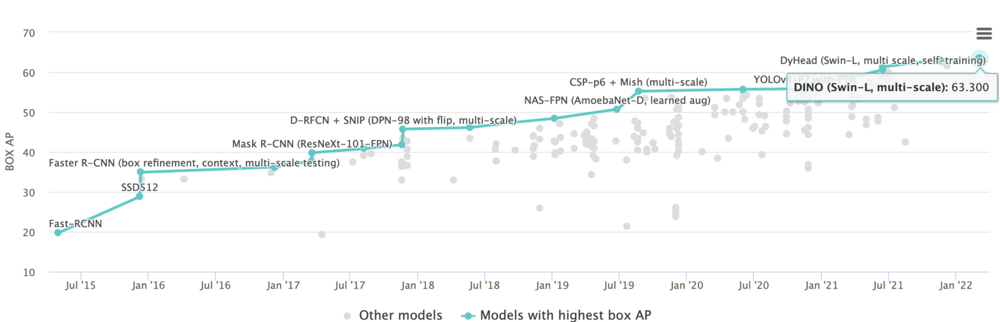


We observe that our current detection models obtain much lower mAP on detecting Small Objects compared to Large and Medium Objects. While most modern detection models can reach 50-60 percent accuracy on Large Objects, their accuracy on Small Objects stagnates at around 20-30 percent.


| Object Groups by Size | Small Objects| Medium Objects | Large Objects  | 
|-----------------------|--------------|----------------|----------------|
| Average mAP over all Tested Models| 0.25021      | 0.45029 | 0.54533 |


Given example of the above-mentioned SWIN-S model(0.482-mAP), we can see that while it can predict large objects with 0.627% accuracy, it only achieves 0.321% accuracy on small objects. If we look more closely at the performance breakdown by object category, we can see that detection performance varies hugely between large objects like “airplane | 0.728% |”, “bus | 0.716% |” and small objects like “hair drier | 0.110% |” and “traffic light | 0.311% |”.


| category      | AP    | category     | AP    | category       | AP    |
|---------------|-------|--------------|-------|----------------|-------|
| person        | 0.583 | bicycle      | 0.380 | car            | 0.497 |
| motorcycle    | 0.501 | airplane     | 0.728 | bus            | 0.716 |
| train         | 0.708 | truck        | 0.423 | boat           | 0.333 |
| traffic light | 0.311 | fire hydrant | 0.734 | stop sign      | 0.679 |
| parking meter | 0.532 | bench        | 0.322 | bird           | 0.409 |
| cat           | 0.726 | dog          | 0.692 | horse          | 0.646 |
| sheep         | 0.574 | cow          | 0.623 | elephant       | 0.677 |
| bear          | 0.764 | zebra        | 0.691 | giraffe        | 0.697 |
| backpack      | 0.232 | umbrella     | 0.456 | handbag        | 0.241 |
| tie           | 0.382 | suitcase     | 0.478 | frisbee        | 0.710 |
| skis          | 0.313 | snowboard    | 0.453 | sports ball    | 0.478 |
| kite          | 0.464 | baseball bat | 0.394 | baseball glove | 0.431 |
| skateboard    | 0.608 | surfboard    | 0.458 | tennis racket  | 0.569 |
| bottle        | 0.444 | wine glass   | 0.410 | cup            | 0.490 |
| fork          | 0.459 | knife        | 0.307 | spoon          | 0.302 |
| bowl          | 0.466 | banana       | 0.315 | apple          | 0.260 |
| sandwich      | 0.445 | orange       | 0.365 | broccoli       | 0.272 |
| carrot        | 0.255 | hot dog      | 0.436 | pizza          | 0.558 |
| donut         | 0.539 | cake         | 0.453 | chair          | 0.364 |
| couch         | 0.509 | potted plant | 0.364 | bed            | 0.495 |
| dining table  | 0.307 | toilet       | 0.668 | tv             | 0.630 |
| laptop        | 0.678 | mouse        | 0.652 | remote         | 0.432 |
| keyboard      | 0.543 | cell phone   | 0.415 | microwave      | 0.629 |
| oven          | 0.392 | toaster      | 0.402 | sink           | 0.418 |
| refrigerator  | 0.645 | book         | 0.194 | clock          | 0.540 |
| vase          | 0.408 | scissors     | 0.453 | teddy bear     | 0.528 |
| hair drier    | 0.110 | toothbrush   | 0.384 | None           | None  |


Similar results can be observed for a state of the art CNN-Based ResNeSt-101 model with comparable overall performance(0.477-mAP): “0.614-Large Objects”, “0.301-Small Objects”, “airplane | 0.725% |”, “bus | 0.710% |”, “hair drier | 0.065% |”, “traffic light | 0.314% |. Thus we have reason to believe the both CNN and Transformer architectures suffer from small object detection.


| category      | AP    | category     | AP    | category       | AP    |
|---------------|-------|--------------|-------|----------------|-------|
| person        | 0.602 | bicycle      | 0.364 | car            | 0.510 |
| motorcycle    | 0.491 | airplane     | 0.725 | bus            | 0.710 |
| train         | 0.701 | truck        | 0.403 | boat           | 0.330 |
| traffic light | 0.314 | fire hydrant | 0.727 | stop sign      | 0.700 |
| parking meter | 0.502 | bench        | 0.297 | bird           | 0.409 |
| cat           | 0.754 | dog          | 0.694 | horse          | 0.625 |
| sheep         | 0.588 | cow          | 0.615 | elephant       | 0.697 |
| bear          | 0.763 | zebra        | 0.725 | giraffe        | 0.725 |
| backpack      | 0.200 | umbrella     | 0.478 | handbag        | 0.203 |
| tie           | 0.419 | suitcase     | 0.458 | frisbee        | 0.731 |
| skis          | 0.304 | snowboard    | 0.486 | sports ball    | 0.508 |
| kite          | 0.477 | baseball bat | 0.390 | baseball glove | 0.457 |
| skateboard    | 0.620 | surfboard    | 0.464 | tennis racket  | 0.577 |
| bottle        | 0.456 | wine glass   | 0.421 | cup            | 0.486 |
| fork          | 0.436 | knife        | 0.288 | spoon          | 0.249 |
| bowl          | 0.466 | banana       | 0.292 | apple          | 0.253 |
| sandwich      | 0.404 | orange       | 0.313 | broccoli       | 0.267 |
| carrot        | 0.270 | hot dog      | 0.423 | pizza          | 0.570 |
| donut         | 0.550 | cake         | 0.423 | chair          | 0.347 |
| couch         | 0.476 | potted plant | 0.321 | bed            | 0.493 |
| dining table  | 0.324 | toilet       | 0.649 | tv             | 0.616 |
| laptop        | 0.662 | mouse        | 0.647 | remote         | 0.439 |
| keyboard      | 0.566 | cell phone   | 0.419 | microwave      | 0.606 |
| oven          | 0.396 | toaster      | 0.340 | sink           | 0.412 |
| refrigerator  | 0.662 | book         | 0.203 | clock          | 0.557 |
| vase          | 0.414 | scissors     | 0.384 | teddy bear     | 0.543 |
| hair drier    | 0.065 | toothbrush   | 0.349 | None           | None  |


# **5. Photo/Video Demo and Error Analysis**

### experiment 9: NBA image

For this NBA image, which is very crowded with person(s). Many person(s) are detected with high score, but also many person(s) are detected with very low score, which shows a low degree of confidence. Many person(s) are not detected.

### experiment 10: Ackerman Union image
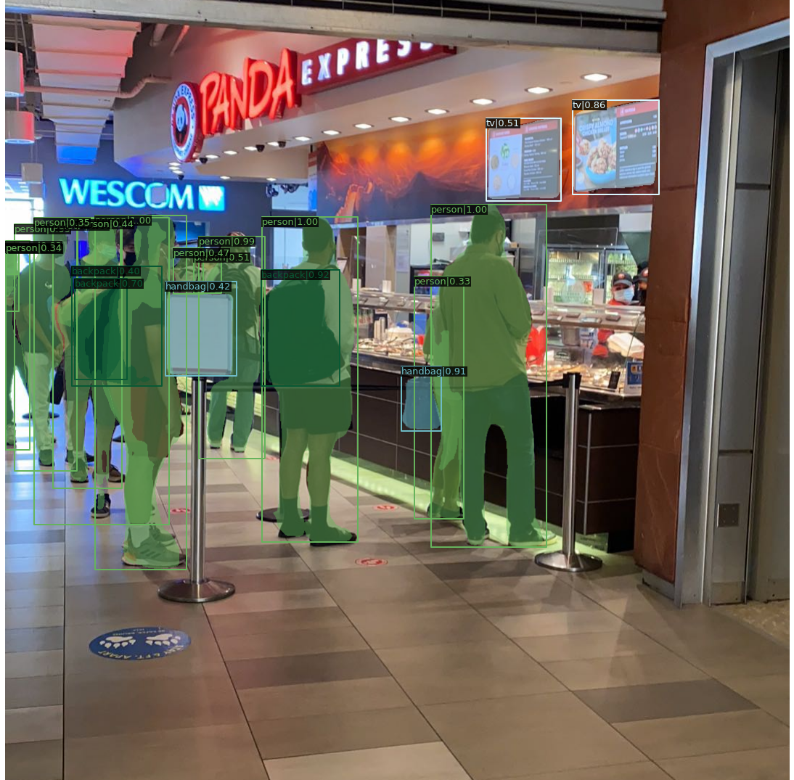
This result is very good, almost correctly identified every instance, such as "person" and "TV".
### experiment 11: birthday image
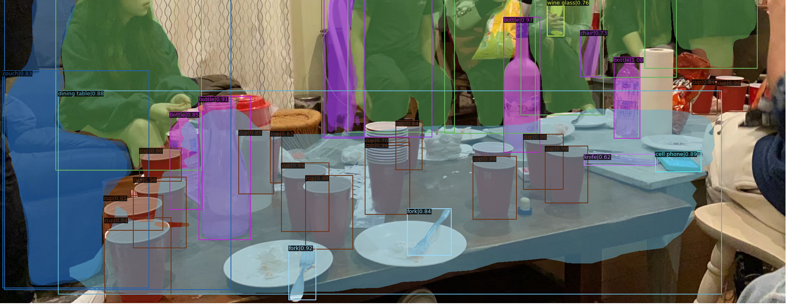
very good result, "cup", "table", "fork", "knife", "cell phone", "wine glass", "bottle", "couch" are perfectly identified with greater than 0.5 score.
### experiment 12: UCLAhealth image
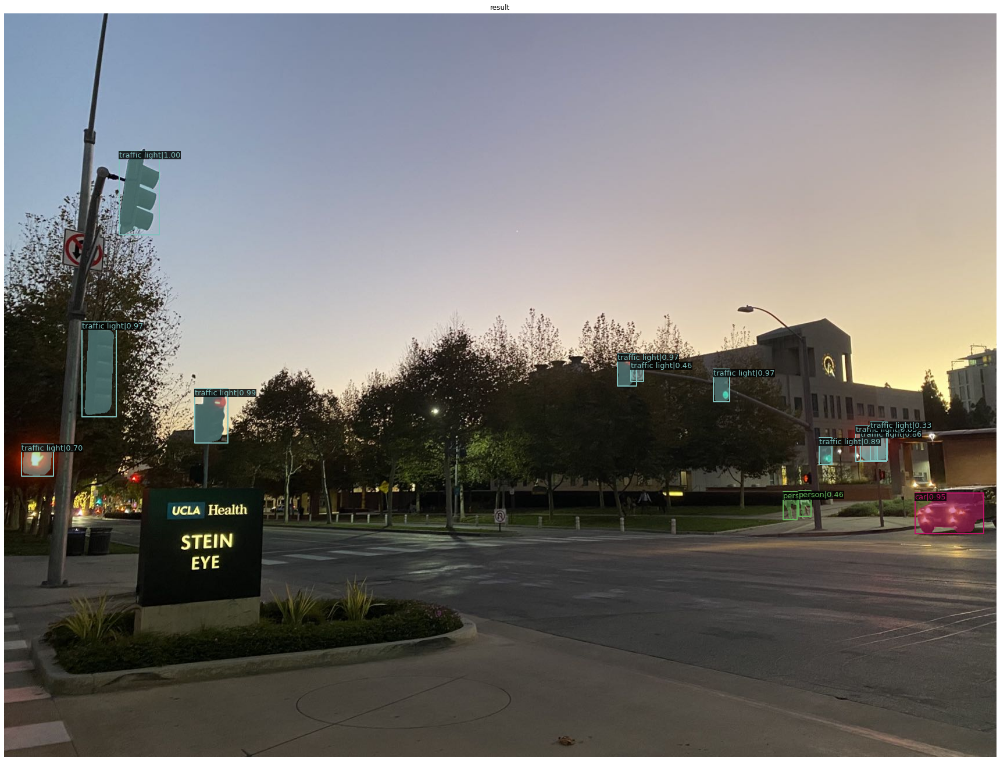
"traffic light", car(s), person(s) are correctly identified, pretty good. Other objects such as "tree"s and "street light"s are not identified.

### experiment 13: Concert image
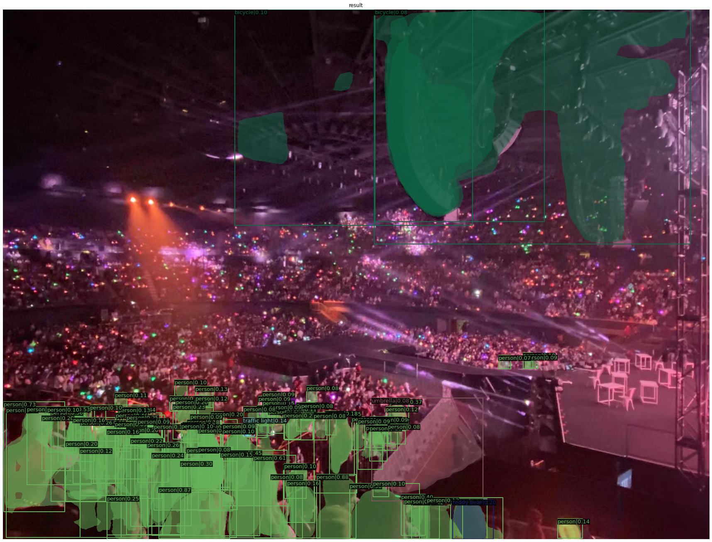
closer person(s) are identified, but person(s) far away blended with colorful lights are not identified. A human observer can identify those are person(s) due to the semantic background of a concert, but this algorithm cannot do that, it is still mainly depending on pixel-wise image patterns. Also, something on the ceiling is seen as bicycles, which are mistakes, again proving the algorithm is based on shapes and patterns, not meaning and syntax.

### experiment 8:
We also tested on our own video examples. The algorithm deals with data in .mp4 format.
The video is transformed into gif for presentation purpose.


### Videos
On Bruinwalk, the algorithm has very high accuracy, it is able to recognize persons, trucks, umbrellas, fire hydrants. Interestingly, it mistakenly sees the bruin bear statue as an elephant.
Also, it mistakenly sees a banner on the ground as a parking meter.
It  mistakenly sees an advertising image on the banner as a book, probably because it looks like a book's cover.
Another interesting discovery is that the algorithm recognizes a tree's mirror image in a building's window as a [potted plant], it even can detect mirror images!
it at an instant mistakenly sees a gap in the tree's leaves as a car.
it mistakenly sees a four-footed banner as a chair.
it mistakenly sees a four-footed banner as a chair.
it mistakenly sees a handrail of a stair as an airplane.
In the Rochester-Midvale street view video, it correctly identifies many potted plants and cars. However, it frequently identifies some gaps in the tree leaves as elephants or horses.
In the cooking video, it correclt identifies many bowls, a sink, and carrots, but it mistakenly sees some bowls as clocks or vases, probably due to the shape of these bowls are indeed artistic in a sense. It sees an orange-colored plate as an orange mistakenly. It sees a plate as a frisbee mistakenly. It sees romain hearts as broccoli mistakenly. It sees a pot as a bird mistakenly, very strange. It mistakenly sees a bottled soy sauce and a bottled olive oil as wines. Indeed it's a hard topic to teach algorithms distinguishing which bottle is soyce sauce, which bottle is wine, oil, vinegar, it does not have taste! It mistakenly sees a pot with a glass lid as a wine glass.

In conclusion, the mistakes made are all reasonable because of the similarity in shape between the object represented by the true label and the object represented by the wrong label, especially given the 2D image or video.
The reaction rate of the algorithm is much faster than humans. Given the variety and the large number of objects in the video and such a high speed to change the perspective, a human watcher of the video cannot detect all details, but the algorithm is able to detect almost every small tiny object on the very edge of the image that does not draw a human's attention.

# **6. Adversarial Attacks and Error Analysis**


Fast RCNN

```python
!mkdir checkpoints
!wget -c https://download.openmmlab.com/mmdetection/v2.0/mask_rcnn/mask_rcnn_r50_caffe_fpn_mstrain-poly_3x_coco/mask_rcnn_r50_caffe_fpn_mstrain-poly_3x_coco_bbox_mAP-0.408__segm_mAP-0.37_20200504_163245-42aa3d00.pth \
      -O checkpoints/mask_rcnn_r50_caffe_fpn_mstrain-poly_3x_coco_bbox_mAP-0.408__segm_mAP-0.37_20200504_163245-42aa3d00.pth
```

```python
from mmdet.apis import inference_detector, init_detector, show_result_pyplot

# Choose to use a config and initialize the detector
config = 'configs/mask_rcnn/mask_rcnn_r50_caffe_fpn_mstrain-poly_3x_coco.py'
# Setup a checkpoint file to load
checkpoint = 'checkpoints/mask_rcnn_r50_caffe_fpn_mstrain-poly_3x_coco_bbox_mAP-0.408__segm_mAP-0.37_20200504_163245-42aa3d00.pth'
# initialize the detector
model = init_detector(config, checkpoint, device='cuda:0')
```

```python
import matplotlib.pyplot as plt
import mmcv
import cv2
import numpy as np
from google.colab.patches import cv2_imshow
# Use the detector to do inference
img = mmcv.imread('demo/demo.jpg')
plt.figure(figsize=(15, 10))
plt.imshow(mmcv.bgr2rgb(img))
# print(img.shape) #(427, 640, 3)

# Draw a Rectangle in
image = np.zeros((512,512,3), np.uint8)
# cv2.rectangle(image, (100,100), (300,250), (127,50,127), -1)
cv2.rectangle(img, (310,220), (360,270), (0,0,0), -1)
cv2_imshow(img)
cv2.waitKey(0)
cv2.destroyAllWindows()

plt.show()

result = inference_detector(model, img)
```

```python
# Let's plot the result
show_result_pyplot(model, img, result, score_thr=0.3)
```

## Fast RCNN specific positions of black patches and result:

### experiment 1:

```python
cv2.rectangle(img, (310,220), (360,270), (0,0,0), -1)
```
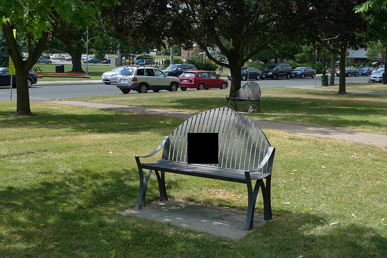

### experiment 2:

```python
cv2.rectangle(img, (100,100), (300,250), (127,50,127), -1)
```

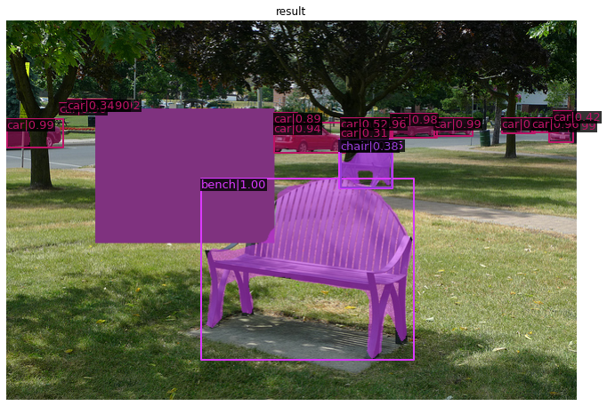

### experiment 3:

```python
cv2.rectangle(img, (300,220), (380,270), (0,0,0), -1)
```

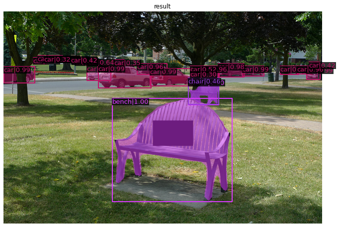
### experiment 4:

```python
cv2.rectangle(img, (280,200), (400,300), (0,0,0), -1)
```

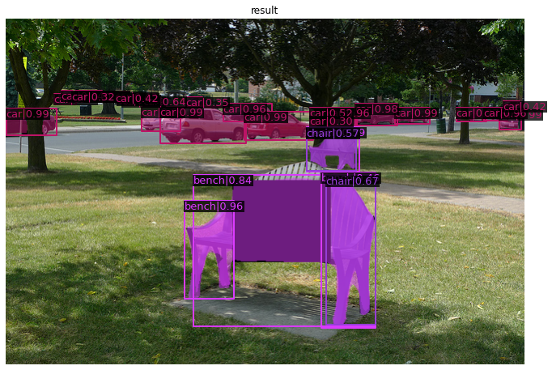
### experiment 5:

```python
cv2.rectangle(img, (260,190), (410,320), (0,0,0), -1)
```

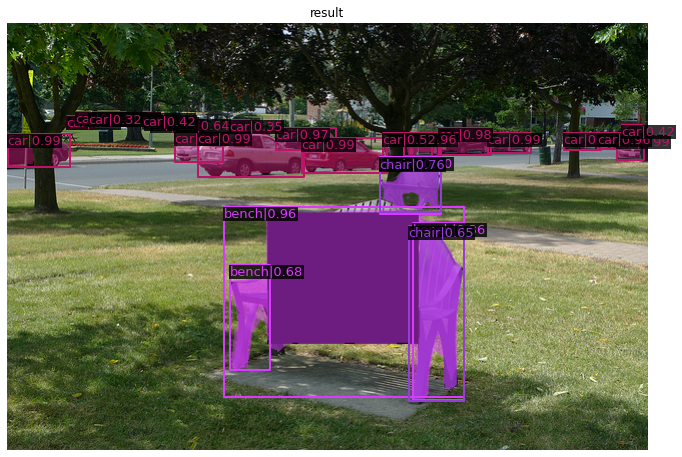

### experiment 6:

experiment using our living room’s picture, the little black patch at the top left corner does not catch attention of the algorithm.


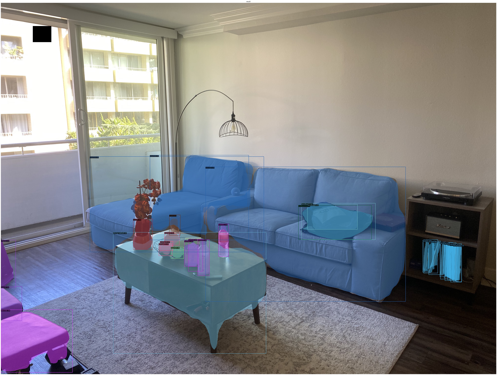

### experiment 7:

```python
cv2.rectangle(img, (700,800), (1000,1000), (0,0,0), -1)
```

network is fooled to recognize our black patch as a “TV” with score = 0.63

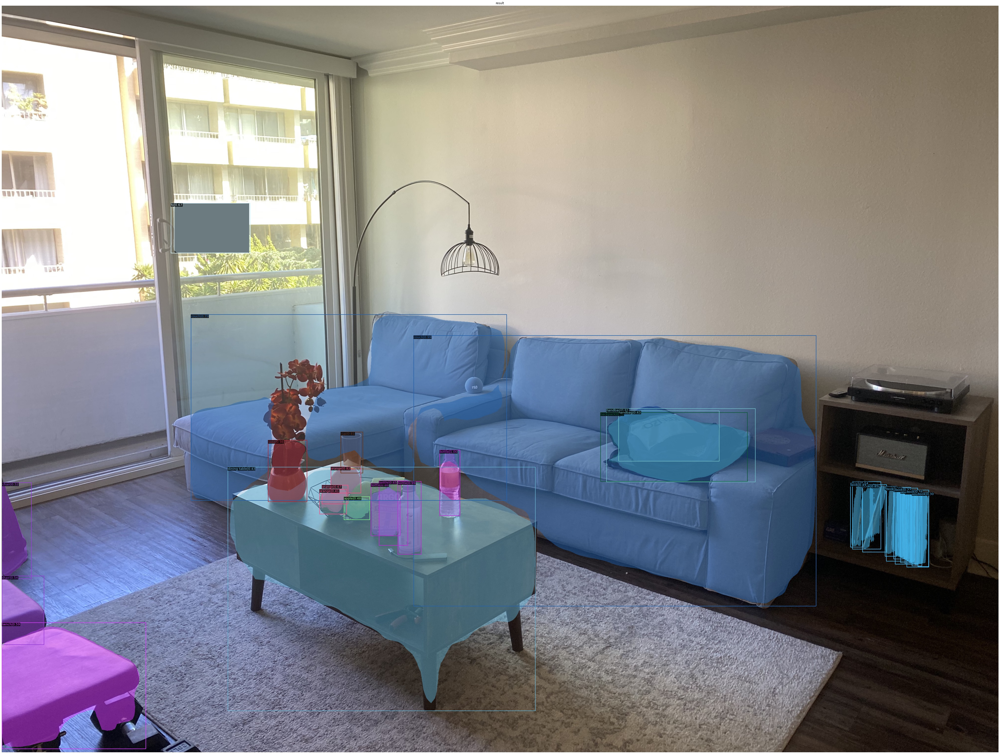


### experiment 14: bruinwalk image
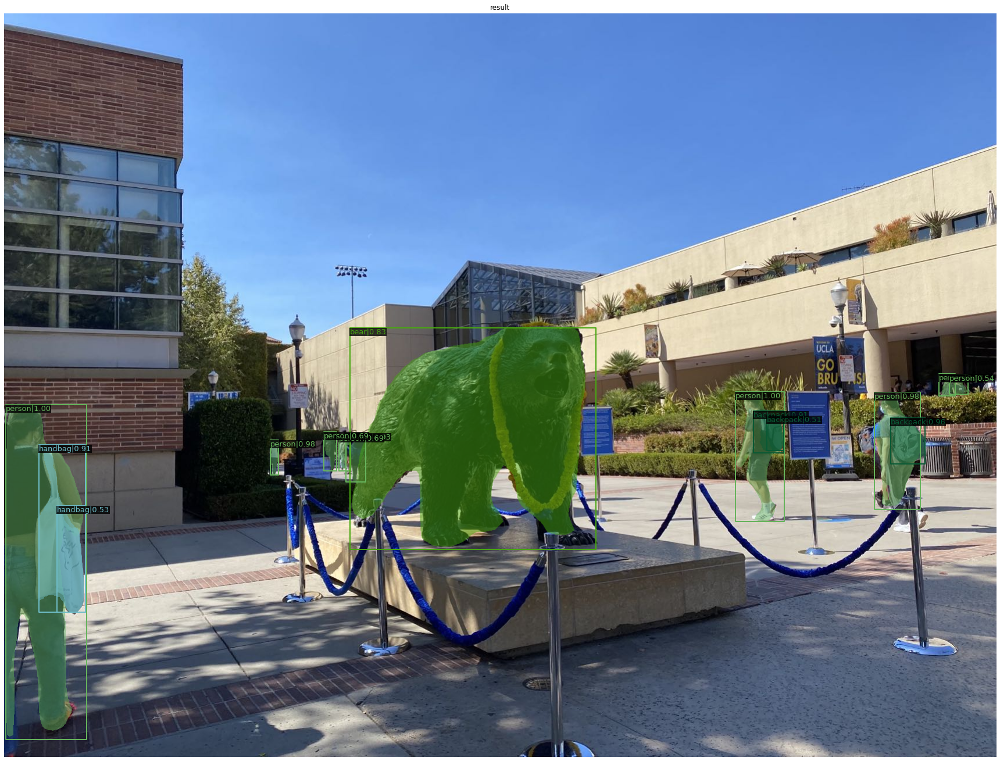
bear, person, and bags are identified correctly.
 
### experiment 15: bruinwalk images with a black patch
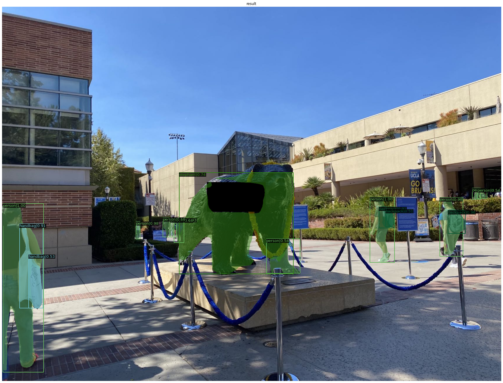
The black patch makes the algorithm thinks the bear is an elephant. The algorithm is influenced by the black patch.

### Experiments Analysis
#### Static images
The detection algorithm works well on the demo image provided by the MMdetection itself with high accuracy and low error rates.
If we set the score threshold to be 0.5, i.e. only display the objects for which the score given to objects category larger than 0.5, we can almost get every object with correct bounding boxes and class labels.

For the customized image, which is not provided by MMDetection but by us, i.e. the living room image, it makes more mistakes. For example, it misrecognize an [orange] to be an [apple]. Also, the [vinyl CDs] are misrecognized as [books]. Probably it is due to the side view of the CDs are indeed very similar to books, and the orange from such a far away point of view looks indeed indistinguishable from an apple, and they are both very likely to placed in plates on the living room table. The mistakes are understandable since a human may even make such misrecognitions given this specific image.
The black patches on our customized image, when small, even does not draw attention from the algorithm--it does not give a bounding box, which means it does not assume it to be an object. When the black patch becomes large, the algorithm misrecognizes it as a TV, which is very interesting. This recognition makes very much sense, since a black squared-shape object in side a living room is indeed very likely to be a TV. Although the algorithm is fooled, I think this TV misrecognition, on the contrary, proves the wisdom of the model in a sense. 


#### Images with black patch attacks
For black patches interference experiments, if the black patch is small compared to the size of the object, the detection algorithm is little affected. It still gives correct bounding box and class labels with as high scores as 1.00.
However, when the black patch grows in size to about half the size of the object, and blurs certain significant edges and shapes of the object, like in experiment 4 and 5, the algorithm will be fooled.

Swin

```python
!mkdir checkpoints
!wget -c https://download.openmmlab.com/mmdetection/v2.0/swin/mask_rcnn_swin-s-p4-w7_fpn_fp16_ms-crop-3x_coco/mask_rcnn_swin-s-p4-w7_fpn_fp16_ms-crop-3x_coco_20210903_104808-b92c91f1.pth \
      -O checkpoints/mask_rcnn_swin-s-p4-w7_fpn_fp16_ms-crop-3x_coco_20210903_104808-b92c91f1.pth
```

```python
from mmdet.apis import inference_detector, init_detector, show_result_pyplot

# Choose to use a config and initialize the detector
config = 'configs/swin/mask_rcnn_swin-s-p4-w7_fpn_fp16_ms-crop-3x_coco.py'
# Setup a checkpoint file to load
checkpoint = 'checkpoints/mask_rcnn_swin-s-p4-w7_fpn_fp16_ms-crop-3x_coco_20210903_104808-b92c91f1.pth'
# initialize the detector
model = init_detector(config, checkpoint, device='cuda:0')
```

```python
import matplotlib.pyplot as plt
import mmcv
import cv2
import numpy as np
from google.colab.patches import cv2_imshow
# Use the detector to do inference
img = mmcv.imread('demo/demo.jpg')
plt.figure(figsize=(15, 10))
plt.imshow(mmcv.bgr2rgb(img))
# print(img.shape) #(427, 640, 3)

# Draw a Rectangle in
image = np.zeros((512,512,3), np.uint8)
# cv2.rectangle(image, (100,100), (300,250), (127,50,127), -1)
cv2.rectangle(img, (310,220), (360,270), (0,0,0), -1)
cv2_imshow(img)
cv2.waitKey(0)
cv2.destroyAllWindows()

plt.show()

result = inference_detector(model, img)
```

```python
# Let's plot the result
show_result_pyplot(model, img, result, score_thr=0.3)
```

In Google Colab, we run
```bash
!python demo/video_demo.py demo/cooking.mp4 \
    configs/swin/mask_rcnn_swin-s-p4-w7_fpn_fp16_ms-crop-3x_coco.py \
    checkpoints/mask_rcnn_swin-s-p4-w7_fpn_fp16_ms-crop-3x_coco_20210903_104808-b92c91f1.pth \
    --out swin_result_cooking.mp4
```
to detect on videos

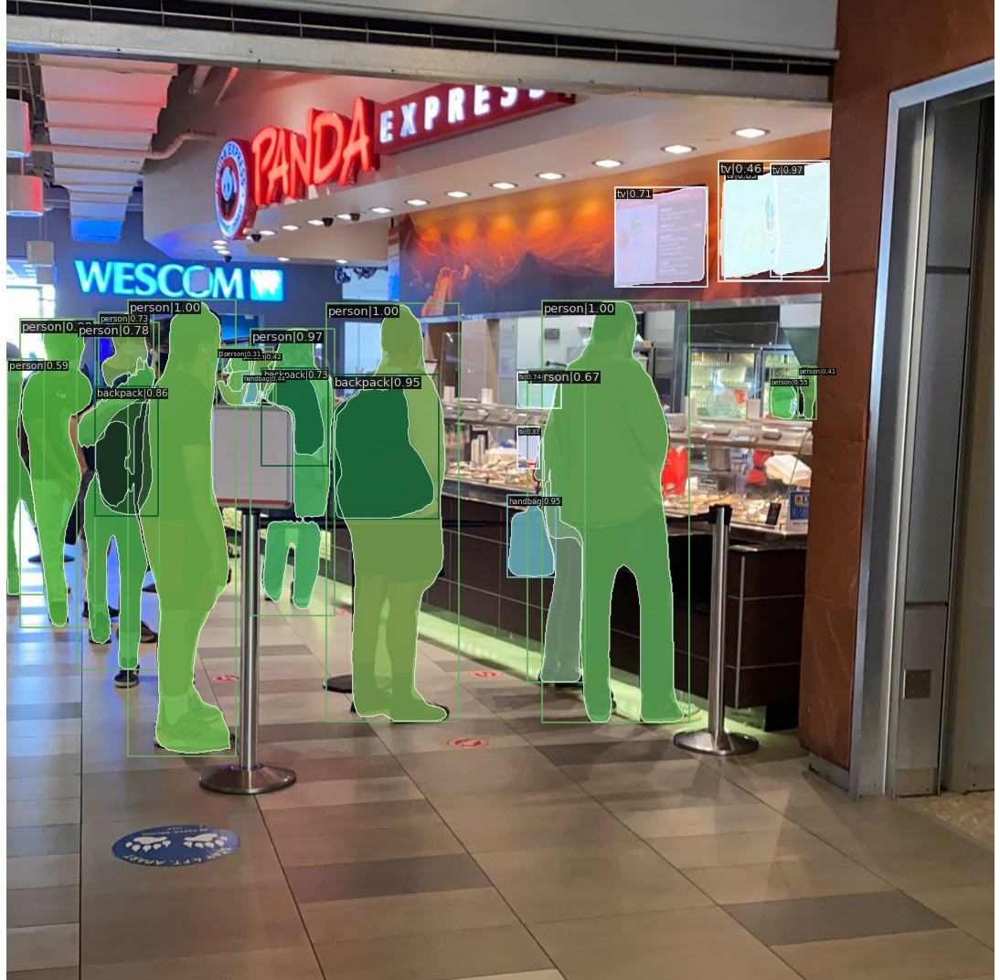

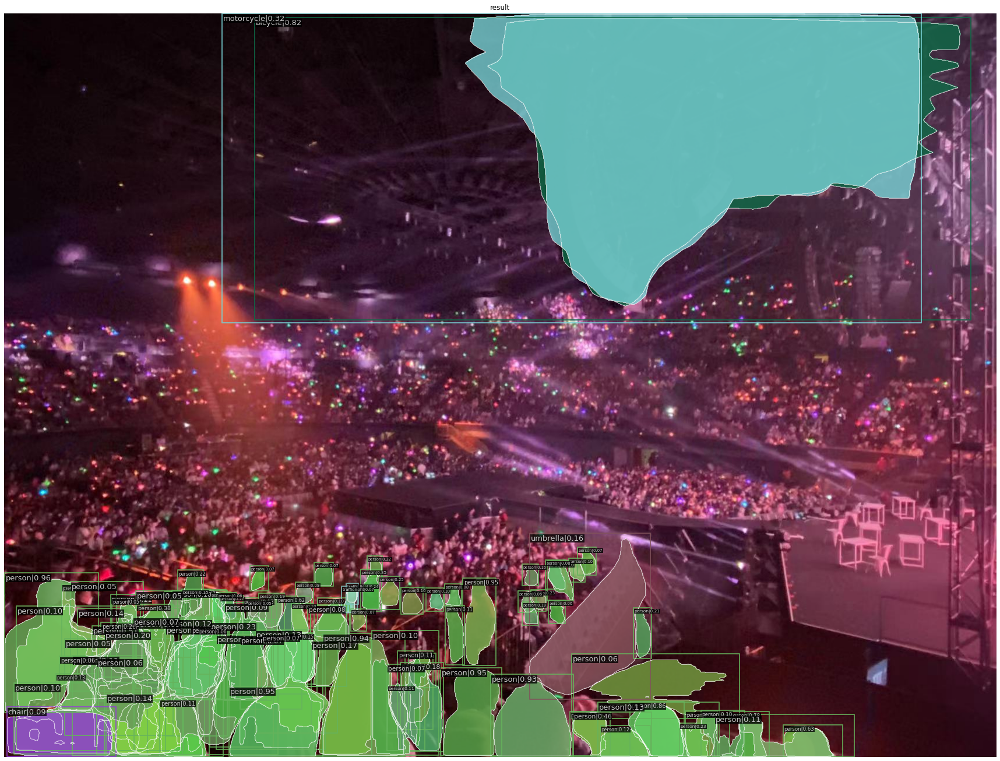
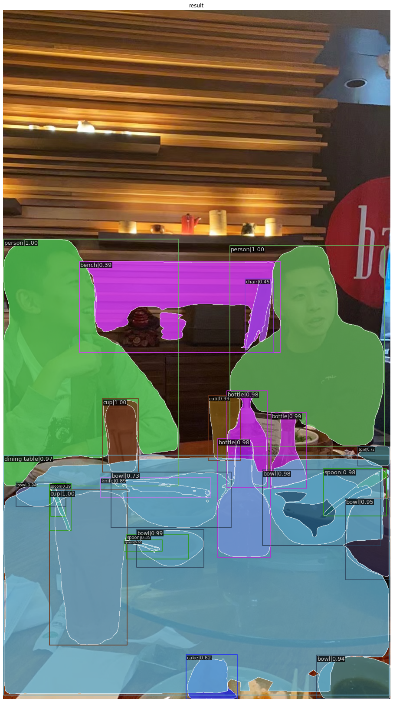

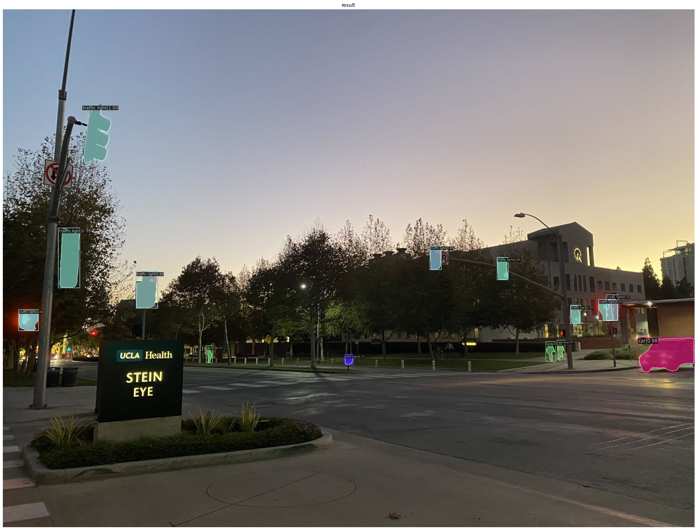

The static images results are almost the same as the outputs of Fast RCNN algorithms


Videos Detected by Swin


Streets
<iframe width="560" height="315" src="https://www.youtube.com/embed/7VnTJPWubTo" title="YouTube video player" frameborder="0" allow="accelerometer; autoplay; clipboard-write; encrypted-media; gyroscope; picture-in-picture" allowfullscreen></iframe>

Cooking

<iframe width="560" height="315" src="https://www.youtube.com/embed/IuktAavc8A" title="YouTube video player" frameborder="0" allow="accelerometer; autoplay; clipboard-write; encrypted-media; gyroscope; picture-in-picture" allowfullscreen></iframe>

Swin Bruinwalk1
<iframe width="560" height="315" src="https://www.youtube.com/embed/5vnvMAk3M3E" title="YouTube video player" frameborder="0" allow="accelerometer; autoplay; clipboard-write; encrypted-media; gyroscope; picture-in-picture" allowfullscreen></iframe>

Swin Bruinwalk2
<iframe width="560" height="315" src="https://www.youtube.com/embed/aOCYYOk2dg0" title="YouTube video player" frameborder="0" allow="accelerometer; autoplay; clipboard-write; encrypted-media; gyroscope; picture-in-picture" allowfullscreen></iframe>

Swin Bruinwalk3
<iframe width="560" height="315" src="https://www.youtube.com/embed/KAxQC_j6QyU" title="YouTube video player" frameborder="0" allow="accelerometer; autoplay; clipboard-write; encrypted-media; gyroscope; picture-in-picture" allowfullscreen></iframe>

For the streets view video, the Swin detection finds an additional stop sign that is not detected by the Fast RCNN, but it also wrongly labeled a non-existent umbrella at the end of the video. Other results are the same with Fast RCNN.

Although the Swin transformer is recognized as the state-of-the-art model in computer vision for many downstream tasks, the results of our experiment shows that it has little difference from the outputs of Fast RCNN -- the former algorithm that came out a few years before. This may be an evidence to suggest that Object Detection field is indeed in declining.

# Evaluate Verifocal-Net on the Pascal-VOC 2007 dataset

### Model settings:

```python
!python3 tools/test.py \
    configs/vfnet/vfnet_r50_fpn_1x_coco.py \
    checkpoints/vfnet_r50_fpn_1x_coco_20201027-38db6f58.pth  \
    --eval bbox proposal \
    --eval-options "classwise=True"
```

### Execution Results:

```python
 <p> /content/mmdetection/mmdet/utils/setup_env.py:33: UserWarning: Setting OMP_NUM_THREADS environment variable for each process to be 1 in default, to avoid your system being overloaded, please further tune the variable for optimal performance in your application as needed.
  f'Setting OMP_NUM_THREADS environment variable for each process '
/content/mmdetection/mmdet/utils/setup_env.py:43: UserWarning: Setting MKL_NUM_THREADS environment variable for each process to be 1 in default, to avoid your system being overloaded, please further tune the variable for optimal performance in your application as needed.
  f'Setting MKL_NUM_THREADS environment variable for each process '
loading annotations into memory...
Done (t=2.28s)
creating index...
index created!
load checkpoint from local path: checkpoints/vfnet_r50_fpn_1x_coco_20201027-38db6f58.pth
[>>] 5000/5000, 4.0 task/s, elapsed: 1239s, ETA:     0s
Evaluating bbox...
Loading and preparing results...
DONE (t=1.29s)
creating index...
index created!
Running per image evaluation...
Evaluate annotation type *bbox*
DONE (t=46.34s).
Accumulating evaluation results...
DONE (t=13.19s).


| category                | IoU            | Area        | category       | AP    | 
|-------------------------|----------------|-------------|----------------|-------| 
 Average Precision  (AP) @|[ IoU=0.50:0.95 | area=   all | maxDets=100 ]  | 0.408 |
 Average Precision  (AP) @|[ IoU=0.50      | area=   all | maxDets=1000 ] | 0.587 |
 Average Precision  (AP) @|[ IoU=0.75      | area=   all | maxDets=1000 ] | 0.441 |
 Average Precision  (AP) @|[ IoU=0.50:0.95 | area= small | maxDets=1000 ] | 0.244 |
 Average Precision  (AP) @|[ IoU=0.50:0.95 | area=medium | maxDets=1000 ] | 0.450 |
 Average Precision  (AP) @|[ IoU=0.50:0.95 | area= large | maxDets=1000 ] | 0.526|
 Average Recall     (AR) @|[ IoU=0.50:0.95 | area=   all | maxDets=100 ]  | 0.598 |
 Average Recall     (AR) @|[ IoU=0.50:0.95 | area=   all | maxDets=300 ]  | 0.598 |
 Average Recall     (AR) @|[ IoU=0.50:0.95 | area=   all | maxDets=1000 ] | 0.619 |
 Average Recall     (AR) @|[ IoU=0.50:0.95 | area= small | maxDets=1000 ] | 0.401 |
 Average Recall     (AR) @|[ IoU=0.50:0.95 | area=medium | maxDets=1000 ] | 0.650 |
 Average Recall     (AR) @|[ IoU=0.50:0.95 | area= large | maxDets=1000 ] | 0.757 |


| category      | AP    | category     | AP    | category       | AP    | 
|---------------|-------|--------------|-------|----------------|-------| 
| person        | 0.557 | bicycle      | 0.305 | car            | 0.445 | 
| motorcycle    | 0.407 | airplane     | 0.654 | bus            | 0.644 | 
| train         | 0.599 | truck        | 0.375 | boat           | 0.274 | 
| traffic light | 0.275 | fire hydrant | 0.682 | stop sign      | 0.632 | 
| parking meter | 0.461 | bench        | 0.219 | bird           | 0.352 | 
| cat           | 0.654 | dog          | 0.620 | horse          | 0.583 | 
| sheep         | 0.498 | cow          | 0.585 | elephant       | 0.637 | 
| bear          | 0.704 | zebra        | 0.679 | giraffe        | 0.676 | 
| backpack      | 0.169 | umbrella     | 0.403 | handbag        | 0.123 | 
| tie           | 0.325 | suitcase     | 0.389 | frisbee        | 0.655 | 
| skis          | 0.239 | snowboard    | 0.274 | sports ball    | 0.462 | 
| kite          | 0.428 | baseball bat | 0.273 | baseball glove | 0.349 | 
| skateboard    | 0.509 | surfboard    | 0.335 | tennis racket  | 0.485 | 
| bottle        | 0.394 | wine glass   | 0.386 | cup            | 0.434 | 
| fork          | 0.310 | knife        | 0.162 | spoon          | 0.136 | 
| bowl          | 0.413 | banana       | 0.239 | apple          | 0.209 | 
| sandwich      | 0.358 | orange       | 0.335 | broccoli       | 0.237 | 
| carrot        | 0.225 | hot dog      | 0.307 | pizza          | 0.495 | 
| donut         | 0.461 | cake         | 0.354 | chair          | 0.270 | 
| couch         | 0.405 | potted plant | 0.288 | bed            | 0.326 | 
| dining table  | 0.178 | toilet       | 0.585 | tv             | 0.558 | 
| laptop        | 0.585 | mouse        | 0.613 | remote         | 0.284 | 
| keyboard      | 0.534 | cell phone   | 0.344 | microwave      | 0.576 | 
| oven          | 0.316 | toaster      | 0.372 | sink           | 0.360 | 
| refrigerator  | 0.533 | book         | 0.148 | clock          | 0.511 | 
| vase          | 0.386 | scissors     | 0.261 | teddy bear     | 0.469 | 
| hair drier    | 0.093 | toothbrush   | 0.234 | None           | None  | 


Evaluating proposal...
Loading and preparing results...
DONE (t=0.56s)
creating index...
index created!
Running per image evaluation...
Evaluate annotation type *bbox*
DONE (t=75.46s).
Accumulating evaluation results...
DONE (t=12.70s).
| category                | IoU            | Area        | category       | AP    | 
|-------------------------|----------------|-------------|----------------|-------| 
 Average Precision  (AP) @|[ IoU=0.50:0.95 | area=   all | maxDets=100 ]  | 0.453 |
 Average Precision  (AP) @|[ IoU=0.50      | area=   all | maxDets=1000 ] | 0.678 |
 Average Precision  (AP) @|[ IoU=0.75      | area=   all | maxDets=1000 ] | 0.486 |
 Average Precision  (AP) @|[ IoU=0.50:0.95 | area= small | maxDets=1000 ] | 0.296 |
 Average Precision  (AP) @|[ IoU=0.50:0.95 | area=medium | maxDets=1000 ] | 0.522 |
 Average Precision  (AP) @|[ IoU=0.50:0.95 | area= large | maxDets=1000 ] | 0.633 |
 Average Recall     (AR) @|[ IoU=0.50:0.95 | area=   all | maxDets=100 ]  | 0.619 |
 Average Recall     (AR) @|[ IoU=0.50:0.95 | area=   all | maxDets=300 ]  | 0.619 |
 Average Recall     (AR) @|[ IoU=0.50:0.95 | area=   all | maxDets=1000 ] | 0.619 |
 Average Recall     (AR) @|[ IoU=0.50:0.95 | area= small | maxDets=1000 ] | 0.448 |
 Average Recall     (AR) @|[ IoU=0.50:0.95 | area=medium | maxDets=1000 ] | 0.691 |
 Average Recall     (AR) @|[ IoU=0.50:0.95 | area= large | maxDets=1000 ] | 0.820 |

 ```


## Reference
---

[1] Liu, Ze, et al. "Swin Transformer: Hierarchical Vision Transformer Using Shifted Windows." *Proceedings of the IEEE/CVF International Conference on Computer Vision (ICCV)*. 2021.
[2] Wang, Wenhai, et al. "Pyramid Vision Transformer: A Versatile Backbone for Dense Prediction Without Convolutions." *Proceedings of the IEEE/CVF International Conference on Computer Vision (ICCV)*. 2021.
[3] He et al. "Deep Residual Learning for Image Recognition." *IEEE Conference on Computer Vision and Pattern Recognition (CVPR)*. 2016.
[4] Wang et al. "Pyramid Vision Transformer: A Versatile Backbone for Dense Prediction without Convolutions." *Proceedings of the IEEE/CVF International Conference on Computer Vision (ICCV)*. 2021.
[5] Wang et al. "Pvtv2: Improved baselines with pyramid vision transformer." *arXiv preprint arXiv:2106.13797*. 2021.
[6] Zhang, Hang, et al. "ResNeSt: Split-Attention Networks." *arXiv preprint arXiv:2004.08955*. 2021.
[7] Gao, Shang-Hua, et al. "Res2Net: A New Multi-Scale Backbone Architecture." *Proceedings of the IEEE Transactions on Pattern Analysis and Machine Intelligence (TPAMI)*. 2021.
[8] Chen, Kai, et al. "MMDetection: Open MMLab Detection Toolbox and Benchmark. " *arXiv preprint arXiv:1906.07155*. 2019.


## Code Repository
---

[MMDetection Main](https://github.com/open-mmlab/mmdetection)

[PVT and PVTv2](https://github.com/whai362/PVT)

[Swin Transformer](https://github.com/microsoft/Swin-Transformer)

[ResNeSt](https://github.com/zhanghang1989/ResNeSt)

[Res2Net](https://github.com/Res2Net/Res2Net-PretrainedModels)

[ResNet](https://github.com/KaimingHe/deep-residual-networks)


