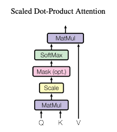
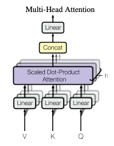
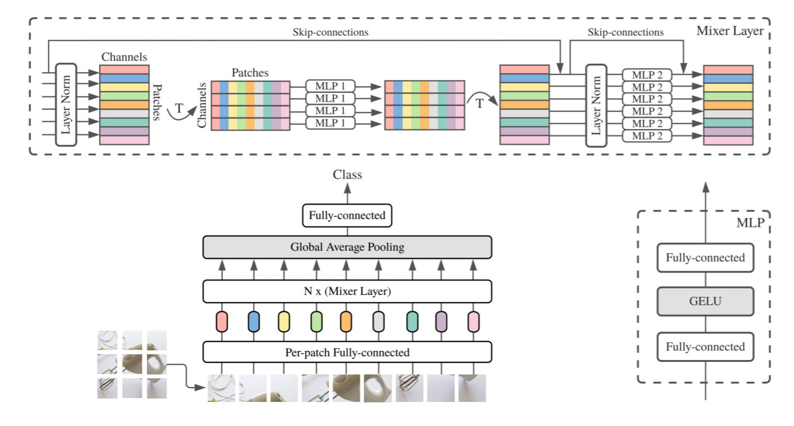
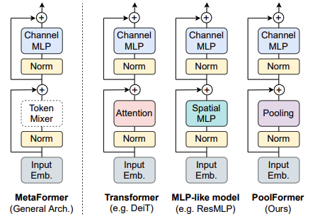
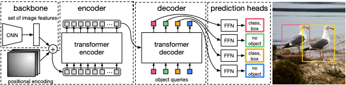

> Our previous topic was on egocentric Pose Estimation, however, due to the complications of setting up physical environment GUI using Google Cloud and the incompleteness of the official repository, after discussing with Prof. Zhou, we decided to swithc our topic to MetaFormer and DETR.

>As we know, DETR is a recent popular algorithm developed by Facebook (Meta) that performs instance segmentation task without using anchor box, which was one of the core features of networks like Faster R-CNN and Mask R-CNN, significantly reducing the complexity of the training pipeline. The Core of the DETR network is the transformer encoder and transformer decoder, which all utilize the MultiHead Attention module. While reading papers, we came across a paper that discusses the effect of the overall structure of transformer (MetaFormer) and we decided to combine these 2 interesting papers.

<!--more-->
{: class="table-of-content"}
* TOC
{:toc}

## <ins>**1. Introduction**</ins>
Our project is based on previous work [End-to-End Object Detection with Transformers](https://arxiv.org/pdf/2005.12872.pdf) and [MetaFormer is Actually What You Needed for Vision](https://arxiv.org/pdf/2111.11418.pdf). In this project, our goal is to present the DETR, a network proposed by FaceBook Research that performs Anchor-Free Detection, and also incorporate the idea from the second paper. We will construct the PoolFormer proposed in the second paper, and replace the Transformer blocks inside DETR with our PoolFormer, and eventually compare the performances of the two architectures. Because of limitations on computational power, we will not train the network for 300 epochs like stated in the DETR repo, which will take roughly 6 days on an 8-GPU machine, instead we will train both network for fewer epochs. If the performance of the PoolFormer-based DETR is comparable with the performance of the original DETR, then we can do instance segmentation more efficiently because Pooling operation is obviously less computationally expensive comparing to [Multihead Attention](https://arxiv.org/pdf/1706.03762v5.pdf).

## <ins>**2. Technical Details**<ins>

Our implementation of the following algorithms (Multihead Attention, MLP Mixer, Metaformer) can be found in this [Google Colab Notebook.](https://colab.research.google.com/drive/1OCKHvZa6Mf6tQWztIbCpckudYB9GO2bS?usp=sharing)

### **2.1 Attention and Multihead Attention**
 

    
  <text>Figure 1. Scaled Dot-Product Attention [3]</text>

The above image is the overall computation pipeline of the Scaled Dot-Product Attention framework, where Q (query), K (key), V (value) and output are all vectors. The input to each attention block will be query and key of dimension k, and value of dimension v. The reason why we have three key value inputs is as follow: when we are looking at a certain pixel or element, we use its "query" to query other elements' "keys"; and we need the value vector to hold the results. First we will compute the dot products of the query to all the keys (query step), normalize by $\sqrt{d_k}$, and pass the result through a softmax layer. The normalization step here is to avoid the scenario where $d_k$ is very large and thus pusing the softmax function to a region with extremely small gradient, making optimization hard. Eventually we multiply the softmax result with v to get the output. In practice, usually people stack the query, key, and value vectors together into matrices Q, K, and V, and compute the attention result as:

$
Attention(Q, K, V) = softmax(\frac{QK^T}{\sqrt{d_k}})V 
$

    
  <text>Figure 2. Multi-Head Attention [3]</text>

In practice, it is also beneficial to linearly project the query, key, and value vector through different learning mappings. After computing the attention in each channel, we concatenate the final output and project to the final output dimension, allowing the model to jointly attent to information from different representation subspaces at different positions. The computation is as follow:

$ 
MultiHeadAttention(Q, K, V) = Cat(output_1, ... output_n)W^O  
$
where 
$
output_i = Attention(QW_i^Q, KW_i^K, VW_i^V) 
$ 
and projections are matrices 
$
 W_i^Q \in R^{d_{model} \times d_k}, W_i^K \in R^{d_{model} \times d_k} , W_i^V \in R^{d_{model} \times d_v} , W^O \in R^{hd_v \times d_{model}} 
$

### <ins>2.2 MLP-Mixer</ins>
 

    
  <text>Figure 3. MLP-Mixer Architecture Overview</text>

MLP-Mixer is an light image architecture designed by Google that does not use any complex techniques including convolutions and self-attention. It is purely based on multi-layer preceptrons(MLPs) with only matrix multiplications, transpositions of data, and nonlinearity operation. It applies the MLP layer cross spatial locations and feature channels repeatedly and sequentially.

In details, for each incoming image, it firstly divides it into multiple same-sized, smaller image patches (also refered as tokens) and reshape the original incoming data accordingly. Then a pre-patch FC(fully-connected) layer is applied to each patch to process the raw data. 

With these operations on the input image, MLP-Mixer further apply token-mixing MLP and channel-mixing MLP. The token-mixing MLP is channel-independent and gives communications between different patches across spatial locations. In reverse, the channel-mixing MLP gives communications cross channels with features, and it is token-independent. Then two types of MLPs are applied interleavedly with skip-connections transpositions of data. 

Inside each MLP, the core is two FC layers with a GELU nonlinearity in between. The first FC expands the dimension to richer the features, the second FC reduces it back to the same number to select those useful features and maintain the dimensionality. In addition, there are also dropout(for avoid overfitting) and LayerNorm(for normalization) applied to each MLP. 

For final output, a GAP(Global Average Pooling) layer and a FC layer is applied in sequential.

With JFT-300M pretrained Vision Transformer, Resnet, and MLP-Mixer tested with top-1 accuracy on ImageNet, the performace of MLP-Mixer is better than Resnet and comparable to Vision Transformer. However, MLP-Mixer is much faster when training and testing. The author of the paper proves that simple architecture can be as good as complex state-of-the-art methods. 

### **2.3 MetaFormer**
 

    
  <text>Figure 4. MetaFormer Architecture Overview [2]</text>

MetaFormer is an architecture mentioned by Weihao Yu in his paper: MetaFormer is Actually What You Need for Vision. He discovers that traditional Transformer and MLP-Mixer share similar structure, which is a combination of some formats of Token Mixer cross spatial location and Channel Mixer cross features channels. In Transformer, this Token Mixer is the Multi-Head Attention mechanism and in MLP-Mixer, it is the Spatial MLP. MetaFormer is exactly structure with this format adding skip-connections and Normalization.

The paper proves that the general architecture shared cross Transformer and MLP-Mixer is actually more important than the specific token-mixing modules being used. To verify this, the author proposes to use extremely simple operation, Average Pooling, as the token mixer. This module is called PoolFormer block. By stacking multiple PoolFormer blocks together, the model achieve state-of-the-art performances on various computer vision tasks such as image classification, object detection, and instance segmentation. Even more, PoolFormer outperforms Transformer architecture and MLP-Mixer in some specific settings.
  

### **2.4 DETR**
 

    
  <text>Figure 5. DETR Architecture Overview [1]</text>

The DETR is a state-of-the-art architecture developed by Facebook to perform anchor-free object detection. It is consisted of a common CNN and a transformer architecture. It predicts all objects at a single pass, and generate a set bipartite matching between the predicted and GT objects. Unlike previous most previous works that focused on autoregressive decoding with RNNs, the DETR model combines bipartite matching loss and transformers with non-autoregressive parllel decoding. It assigns a unique prediction that is invariant to permutation to each GT object, and thus the architecture can emit every prediction in parallel.
  

#### <ins>2.4.1 Set Prediction Loss</ins>
 

In order to score the N predictions with respect to the ground truth and ignore the impact of permutations, DETR search for a bipartite matching between prediction and GT objects by finding the permutation of N elements $\sigma \in G_N$ with the lostest cost:

$
\newcommand{\argminD}{\arg\!\min}
\hat{\sigma} = \argminD_{\sigma \in G_N} \sum_i^N{\mathcal{L}_{match}(y_i, \hat{y_{\sigma(i)}}))} \mathbb{1}_{}
$

Here $ y_i = (c_i, b_i) $ is the ground truth, where $c_i$ is the groud truth class label, and $b_i \in [0, 1]^4$ corresponds to the center x, center y, and height and width with respect to the image size; $\hat{y_{\sigma(i)}}$ is the corresponding prediction. Then we further define:

$
\mathcal{L}_{match}(y_i, \hat{y_{\sigma(i)}}) = -\mathbb{1}_{\{c_i\neq\emptyset\}}\hat{p_{\sigma(i)}}(c_i) + \mathbb{1}_{\{c_i\neq\emptyset\}}\mathcal{L}_{box}(b_i, \hat{b_{\sigma(i)}})
$

where $\hat{p_{\sigma(i)}}(c_i)$ is the probability of class $c_i$ for the prediction with index $\sigma(i)$

After finding out the best permutation $\hat{\sigma}$, the Hungarian Loss for each pair in the previous step is computed as:

$
\mathcal{L}_{Hungarian}(y, \hat{y}) = \sum_{i=1}^N [-log\hat{p_{\sigma(i)}}(c_i) + \mathbb{1}_{\{c_i\neq\emptyset\}}\mathcal{L}_{box}(b_i, \hat{b_{\sigma(i)}})]
$

in which the Bounding Box Loss is defined as a linear combination of the $\mathcal{l}_1$ loss and [Generalized IoU loss (GIoU)](https://giou.stanford.edu/):

$
\mathcal{L}_{box} = \lambda_{GIoU}\mathcal{L}_{GIoU}(b_i, \hat{b_{\sigma(i)}})+\lambda_{L1}||b_i-\hat{b_{\sigma(i)}}||_1 
$ 

where $\lambda_{GIoU},\lambda_{L1} \in \mathbb{R}$ are hyperparameters.
  

#### <ins>2.4.2 DETR Architecture and Module We are Interested In</ins> 
 

    
  <text>Figure 6. DETR Architecture Detailed</text>

The architecture of the model is actually very straightforward. First the image is passed through a CNN backbone for feature (embedding) extraction, like how we used ResNet in our Homeword Assignments, and which CNN backbone to use is flexible. Combining with the position encoding, we pass the embedding into the transformer encoder, where an state-of-the-art Vision Transformer Encoder is used to analyze the question "how much attention a patch pays to another patch," and this is achieved using the core module of this encoder: multi-head attention. The attention can be calculated because, as we stated above, each result in the attention matrix can be viewed as a dot product cosine similarity between the query vector of embedding i and key vector of embedding j.

The Object Queries (inputs to the Decoder Module) has similar functionalities to the Query Matrix of the embeddings passed into the encoder. In the Decoder, using the information about the objects and the encoded embeddings of the input image, the output embeddings are generated and further passed to 2 independent Feedforward Network to get the object class and bounding box.

In this architecture, obviously the heart will be the Multi-Head Self-Attention module, which Weihao et.al [2] defined as a "Token Mixer", and they also pointed out that many replacements to this attention mechanism were actually examined. Attracted by this interesting topic, we will go beyond discussing DETR to evaluate different token mixers (Poolformer, MLP-Mixer-Former) in this post as well.  

### Relevant papers and their repo:
1. End-to-End Object Detection with Transformers 
    [GitHub Link](https://github.com/facebookresearch/detr)
2. MetaFormer is Actually What You Needed for Vision 
    [GitHub Link](https://github.com/sail-sg/poolformer)
3. Attention is All You Needed 
    [GitHub Link](https://github.com/jadore801120/attention-is-all-you-need-pytorch/tree/fec78a687210851f055f792d45300d27cc60ae41)

## Reference
[1] Carion, Nicolas, et al. "End-to-End Object Detection with Transformer", ICCV, 2021

[2] Weihao, Yu, et al. "Metaformer is Actually What You Need For Vision", CVPR, 2021

[3] Vaswani, Ashish, et al. "Attention Is All You Need", Proc. of 31st Intl. Conf. on Neural Information Processing Systems (NeurIPS), 2017

---
