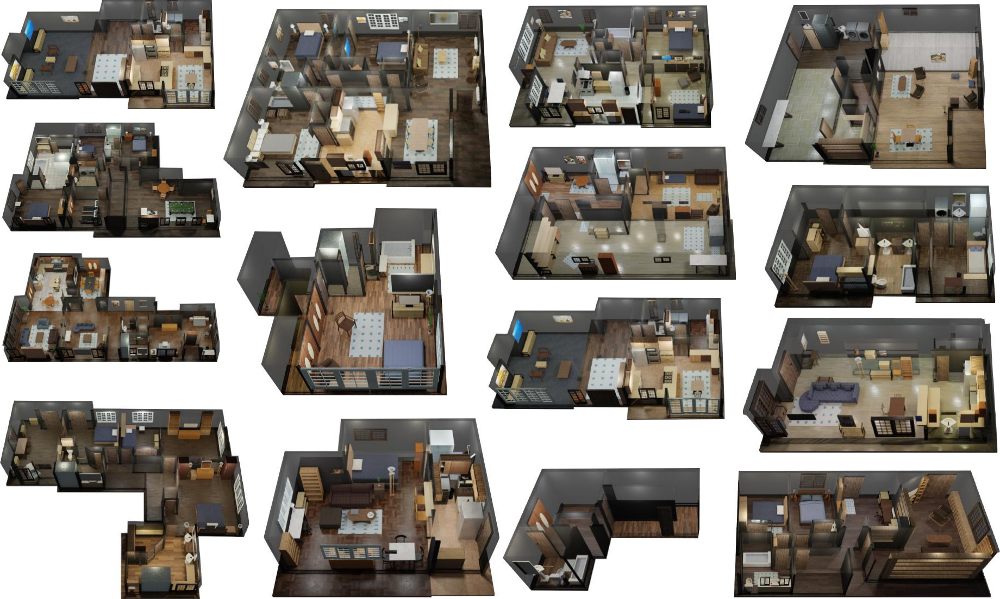
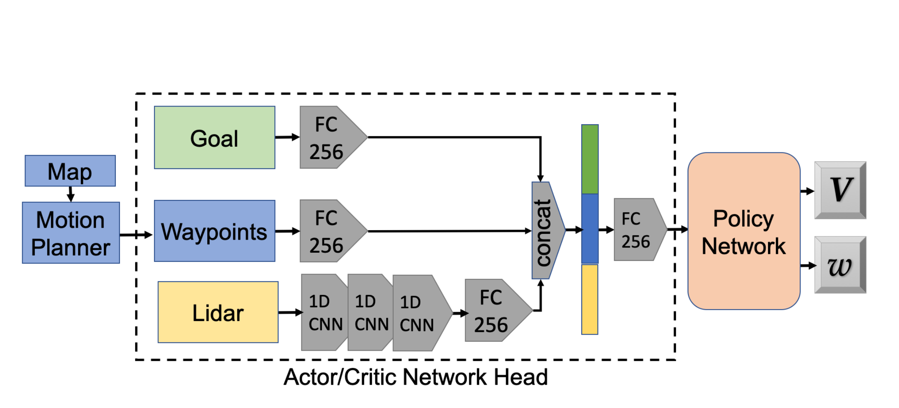
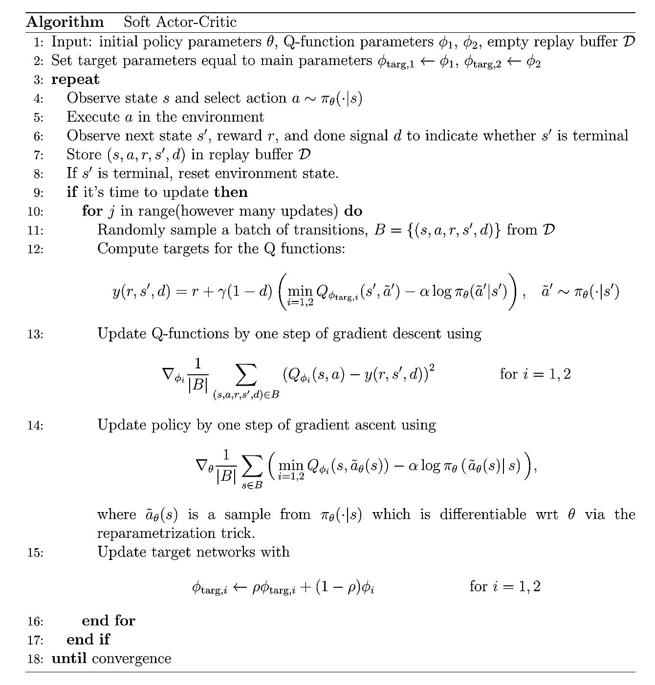
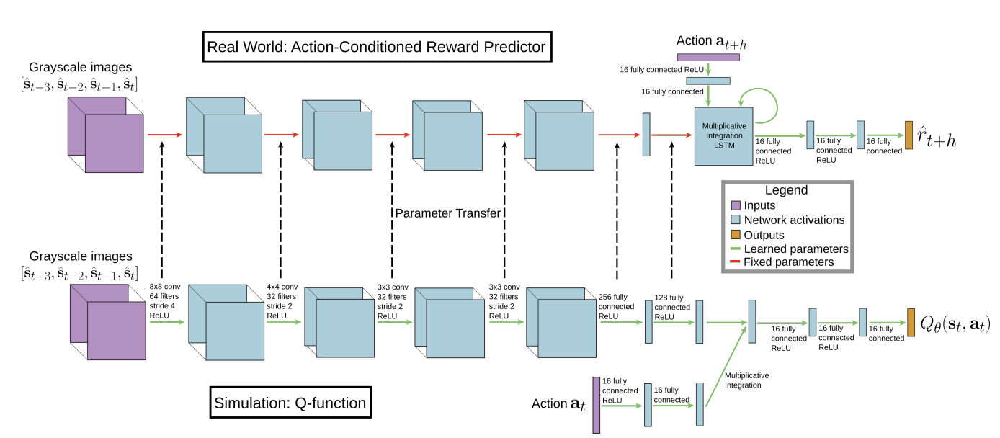

> My project is to investigate current trends in Embodied AI development and research, to report on methods of using virtual environments to enable reinforcement learning, and guide the reader into setting up an interactive environment on their own computer using iGibson.

<!--more-->
{: class="table-of-content"}
* TOC
{:toc}

Main Content
===============

About iGibson
----------------
 iGibson has been a leader in 3D simulation environments for several years now, and the recent release of version 2 has added on to what's possible with embodied AI.  There are three datasets in all including iGibson Scenes, BEHAVIOR Object, and BEHAVIOR Activity dataset.  In addition to the 15 scenes in the iGibson dataset, there is also compatibility with CubiCasa5K and 3D-Front enabling over 12000 scenes to interact in.  The BEHAVIOR Object dataset has a multitude of objects annotated with physical and semantic properties (ranging from food items, furniture, and generic household items) and the Activity dataset provides definitions in BDDL logic language which specifies initial scene configuration and valid final goal states of various activities.  New to version 2.0 is a set of physical properties: {temperature, wetness, cleanliness}.  Objects are labeled has heat sources or heat sinks, and a max temperature reached history is maintained for image display accuracy (burnt objects will still looked burned even if temperature drops).  Contact with water droplets can also change physical appearance, and two different dirt types, dust or stain, determine whether they can be removed with dry or wet cloths.  Also newly implemented in version 2 is the ability to use virtual reality to collect human demonstrations for robot learning [2].
 

{: style="width: 400px; max-width: 100%;"}
*Fig 1. Various scenes from iGibson Dataset* [2].

iGibson provides a wonderful environment for researchers to develop their own learning models in order to improve embedded AI capabilities.  I investigated three such models that used iGibson's environment to train interactive navigation, movement in constrained pedestrian environments, and vision-based autonomous flight.  Because simulations can be done virtually, especially now with use of VR to log human manipulations, a good baseline can be established with which to train robots on in real environments.  This leads to faster productivity and safer training environments.

Full github Repo: https://github.com/StanfordVL/iGibson

Robot Navigation in Constrained Pedestrian Environments using Reinforcement Learning
------------------

This study used iGibson textured meshes to develop waypoints of motion for robots to move within their environment.  They also incorporated virtual Lidar sensors in conjunction with simulated pedestrian movement provided by Optimal Reciprocal Collision Avoidance (ORCA) as input for real-time decision making.  The Neural Network is mapped out below with Fully connected Goal and Waypoints concatenated with Lidar processed through a chain of CNNs that are then fully connected to a Policy Network that determines next step in global trajectory [5].

{: style="width: 400px; max-width: 100%;"}
*Fig 1. Reinforcement Learning Neural Network* [5].

The Soft Actor-Critic algorithm is used to learn the value function and policy.

{: style="width: 400px; max-width: 100%;"}
[5].

Integrating Simulated and Real Data into Deep Reinforcement Learning for Vision-Based Autonomous Flight
---------------------------
This study combined data gained from the simulated model via iGibson, and realtime date received from a drone in order to apply reinforcement learning for autonomous flight. 
A Q-function is trained through a multitude of simulated environments which enables an action-conditioned reward prediction model.  In this model the perception layers are used to process the input image's state.  This model is then loaded into a drone which receives real world data via cameras that continue to train the action model, but parameters are frozen from the Q-function learned in simulation.  With this methodology, the model is able to perform better in unknown environments [4].

{: style="width: 400px; max-width: 100%;"}
*Fig 3. Dual Neural Network* [4].

Hierarchical Reinforcement Learning for Interactive Navigation
-----------
This study explored using hierarchical RL which divides the goal into a higher level which learns phase type and sets a subgoal for the lower level to learn how to achieve.  iGibson environments were used as well as Interactive ToyEnv with goals broken into phases such as 'moving to door', 'opening door', 'moving to goal'.  Rewards and weights are vectorized into success, progress, energy and collision components.  Each level policy were implemented as separate Gated Recurrent Neural Networks.  The observation space is processed through three convolutional layers, and a fully connected layer with ReLU activation in order to extract features.  Other observations are concatenated and processed by a fully connected layer with ReLU.  Features from both branches are concatenated and ran through the GRU to estimate the value function and action distribution.  Action losses of subgoal and embodiment selector are combined and used for back-propagation [3].

How to download and use iGibson for yourself:
------
Above are three ways that iGibson has been used to aid embodied AI research in the last few years.  In addition to several other applications of this particular software, there are several other learning environments as well such as AI2Thor and Habitat which incorporates VQA encoder/decoders.  

To get iGibson up and running on your own computer you must take the following steps:
Need to install simulation environment, as well as download models, objects, and environments:
https://stanfordvl.github.io/iGibson/installation.html

iGibson scenes require a special license you need to apply for, but the Cubicasa and D Front datasets can be installed at https://github.com/StanfordVL/iGibson/tree/master/igibson/utils/data_utils/ext_scene

As this environment takes a lot of processing power, a relatively modern, powerful computer is needed with a good graphics card.

Reference
=======

[1] Bokui Shen, et al. "iGibson 1.0: A Simulation Environment for Interactive Tasks in Large Realistic Scenes." arXiv 10 Aug 2021 https://arxiv.org/pdf/2012.02924v6.pdf

[2] Li, Chengshu, et al. "iGibson 2.0: Object-Centric Simulation for Robot Learning of Everyday Household Tasks." 5th Conference on Robot Learning (CoRL 2021)
https://arxiv.org/pdf/2108.03272.pdf

[3] Li, Chengshu et al, "HRL4IN: Hierarchical Reinforcement Learning for Interactive Navigation with Mobile Manipulators"
arXiv:1910.11432v1 24 Oct 2019
https://arxiv.org/pdf/1910.11432.pdf

[4] Kang, Katie et al, "Generalization through Simulation: Integrating Simulated and Real Data into Deep Reinforcement Learning for Vision-Based Autonomous Flight" 
arXiv:1902.03701v1, 11 Feb 2019
https://arxiv.org/pdf/1902.03701.pdf

[5] Perez, Claudia et al, "Robot Navigation in Constrained Pedestrian Environments using Reinforcement Learning"
arXiv:2010.08600v2, 16Nov 2020
https://arxiv.org/pdf/2010.08600.pdf